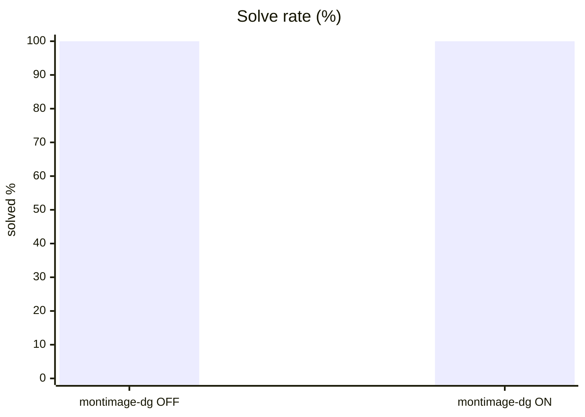
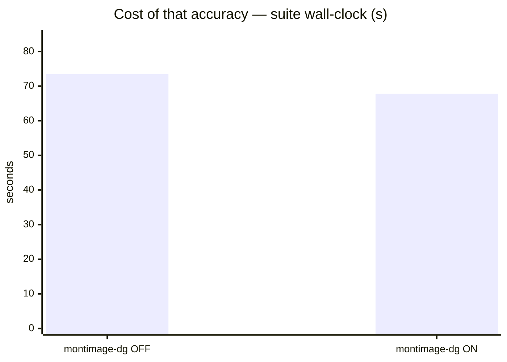
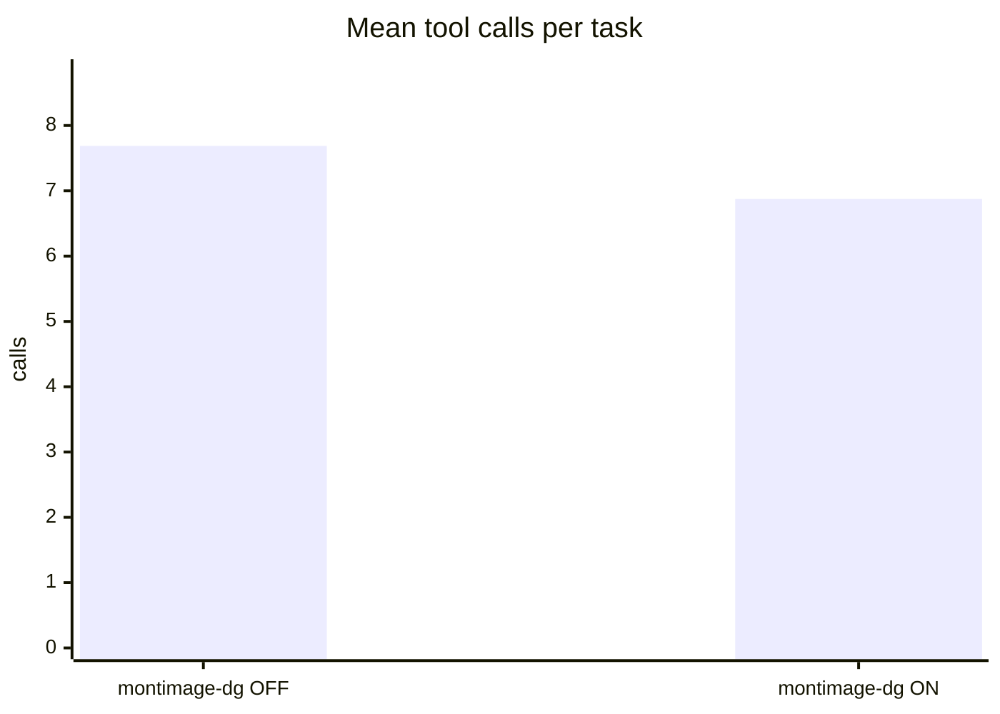
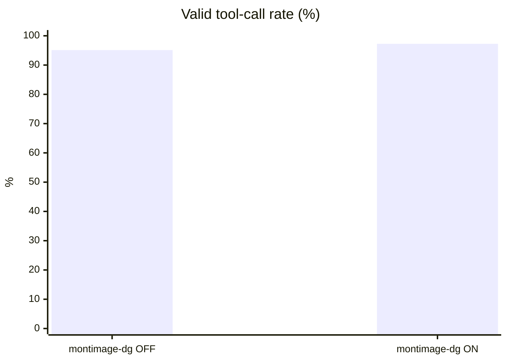

# Agentic tool-calling baseline — Qwen3.6-35B-A3B

**Question.** Can the served model drive a multi-turn tool loop reliably, and does thinking mode help?

**Verdict.** Yes, and the suite is already saturated: 16/16 in both modes. Thinking mode cuts turns by a quarter without changing what gets solved.

## Setup

| | |
|---|---|
| Endpoint | `http://localhost:8001` |
| Tasks | 8 |
| Samples per task | 2 (⇒ 16 generations per run) |
| Concurrency | 4 |
| Metric | pass@1 over hidden executable unit tests |

## Results

| Run | solved | easy | medium | hard | Mean turns | Mean calls | Valid calls | Turn-limit | Wall |
|---|---|---|---|---|---|---|---|---|---|
| **Qwen3.6-35B-A3B think-OFF** | 100.0 % | 100.0 % | 100.0 % | 100.0 % | 6.8 | 7.7 | 95.1 % | 0 | 74 s |
| Qwen3.6-35B-A3B think-ON | 100.0 % | 100.0 % | 100.0 % | 100.0 % | 5.2 | 6.9 | 97.3 % | 0 | 68 s |

<sub>*Valid calls* = tool calls that did not error. *Turn-limit* = runs abandoned after exhausting the turn budget without finishing.</sub>









```mermaid
xychart-beta
    title "pass@1 by difficulty (%)"
    x-axis ["easy", "medium", "hard"]
    y-axis "pass@1 %" 0 --> 100
    line [100, 100, 100]
    line [100, 100, 100]
```

<sub>Line 1 = Qwen3.6-35B-A3B think-OFF · Line 2 = Qwen3.6-35B-A3B think-ON</sub>

## Reading the numbers

**The suite does not discriminate this model — it is a floor, not a ranking.** 16/16 in
both modes. Treat these numbers as a regression baseline: a candidate model that scores
below 100 % here has a real tool-calling problem, but scoring 100 % proves only that it
clears the bar. Harder agentic tasks are needed before this suite can rank models.

**Tool-call hygiene is clean either way.** Zero malformed argument objects and zero
unknown tool names across 32 task runs. The failed calls that do occur are legitimate
environment errors — reading a path that does not exist in `recover_from_bad_path`, or an
`edit_file` whose anchor text was not unique — and the model recovered from all of them.

**Thinking buys fewer turns, not more solves.** 5.2 turns versus 6.8, and no runs stalled
without emitting a tool call (2 did with thinking off). It costs 21 % more output tokens.
Unlike the one-shot code-generation suites, thinking is not harmful here — the reasoning
happens between tool calls, where the token budget is not competing with the answer.

**One harness bug was found and fixed while building this.** `run_python` originally
executed in a temp directory that was discarded, so a script that wrote an output file
left no trace in the workspace. The model correctly wrote a working script, saw nothing
appear, and looped until the turn limit. Programs now sync their file writes back into the
workspace, which is what the earlier 87.5 % run was actually measuring.

## Caveats

- 2 samples per task. Differences under ~8 points are noise, not signal.
- Multi-turn agentic tool use against a sandboxed workspace. One-shot code generation is not exercised here.
- Success is decided by a predicate over the final workspace, never by what the model claims. Every task's oracle is verified to solve it first.
- A task abandoned at the turn limit counts as failed; raise `--max-turns` before concluding the model cannot do it.

## Raw data

- `run-qwen36-think-off.json` — Qwen3.6-35B-A3B think-OFF
- `run-qwen36-think-on.json` — Qwen3.6-35B-A3B think-ON
