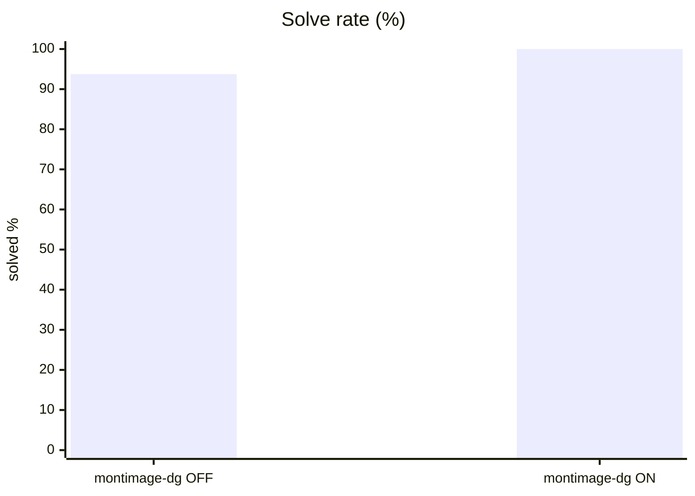
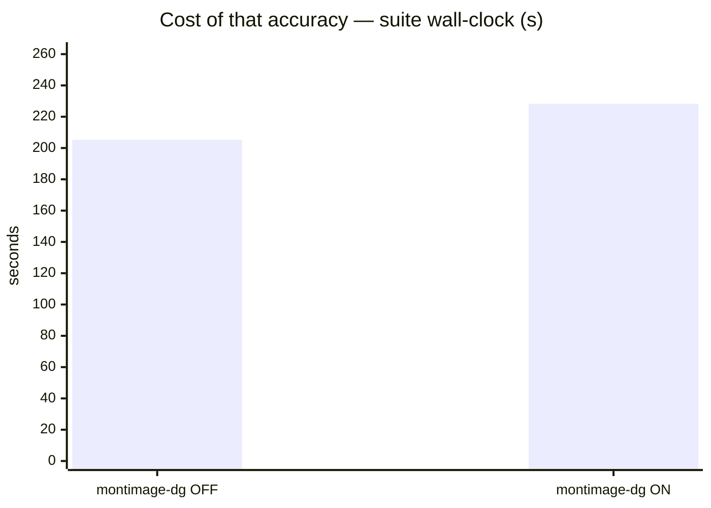
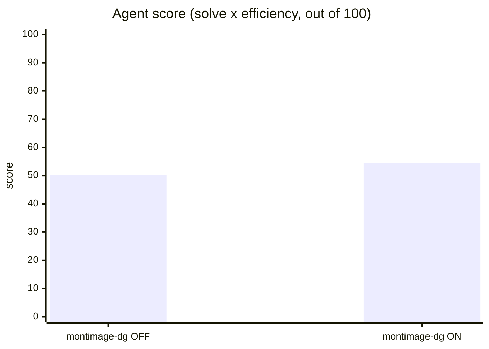
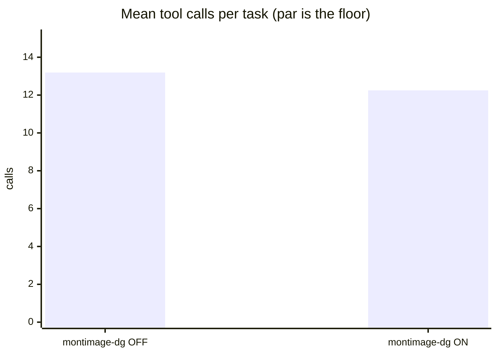
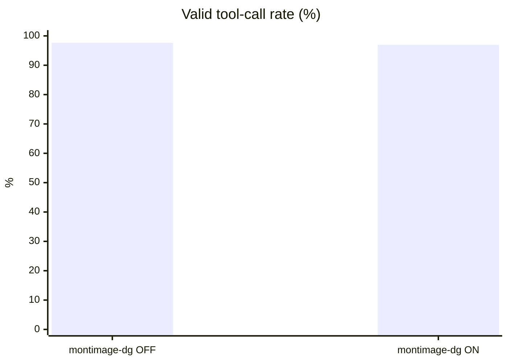
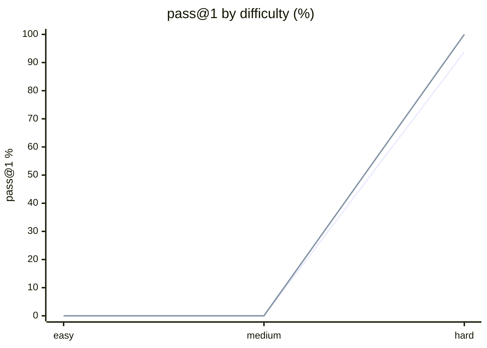

# Agentic ranking suite — Qwen3.6-35B-A3B, thinking off vs on

**Question.** Can a harder agentic suite separate two configurations that both look perfect on the base suite?

**Verdict.** Yes: 50.1 vs 54.6 on the agent score. Solve rate alone still nearly ties; efficiency against oracle par is what separates them.

## Setup

| | |
|---|---|
| Endpoint | `http://localhost:8001/v1` |
| Tasks | 8 |
| Samples per task | 2 (⇒ 16 generations per run) |
| Concurrency | 4 |
| Metric | pass@1 over hidden executable unit tests |

## Results

| Run | Agent score | Solved | Efficiency | Mean calls | Par | Valid calls | Turn-limit | Wall |
|---|---|---|---|---|---|---|---|---|
| Qwen3.6-35B-A3B think-OFF | **50.1** | 93.8 % | 53.5 % | 13.2 | 5.9 | 97.6 % | 0 | 205 s |
| **Qwen3.6-35B-A3B think-ON** | **54.6** | 100.0 % | 54.6 % | 12.2 | 5.9 | 96.9 % | 0 | 228 s |

**Agent score** = solve rate x efficiency, out of 100 — solving is the price of entry, efficiency breaks the ties solve rate cannot. *Efficiency* = par tool calls / calls actually used, capped at 1 and counted only on solved tasks. *Par* is measured by running each task's oracle, so it does not depend on the model. *Valid calls* = calls that did not error. *Turn-limit* = runs abandoned without finishing.

Line 1 = Qwen3.6-35B-A3B think-OFF · Line 2 = Qwen3.6-35B-A3B think-ON

## Where they disagree — Qwen3.6-35B-A3B think-ON vs Qwen3.6-35B-A3B think-OFF

| Task | Qwen3.6-35B-A3B think-ON | Qwen3.6-35B-A3B think-OFF | Winner |
|---|---|---|---|
| `hidden_spec_compliance` | 100 % | 50 % | Qwen3.6-35B-A3B think-ON |

## Reading the numbers

**This suite ranks; the base `agentic` suite does not.** Both configurations solve
essentially everything on the base suite, so it cannot separate them. Here the same model
scores 50.1 and 54.6 depending only on its thinking mode — a gap that exists because
solving is the price of entry and efficiency decides the rest.

**Efficiency is where the headroom is, not correctness.** Both runs sit near 54 %: roughly
twice as many tool calls as the oracle needs (12–13 against a par of 5.9). Re-reading files
already read, running the tests once more after a passing run, and exploratory `list_files`
calls after the layout is known are the recurring patterns. A model that closes that gap
would score 90+ without solving a single extra task.

**Thinking mode helps here, as it did on the base suite.** 100 % solved against 93.8 %, one
fewer call per task, and 7.8 turns against 9.5. This is the opposite of its effect on the
one-shot code-generation suites, where reasoning costs ~13x the output tokens for +1.7
points. The reason is structural: between tool calls the reasoning budget is not competing
with the answer.

**The one failure was the hidden-test task, which is the point.** `hidden_spec_compliance`
gives the model two visible asserts and scores it on eight it never sees. Thinking-off
produced an implementation that satisfied what it could read and rejected a valid
`0033`-prefixed number. Every other task in this suite passed for both configurations, so
without the hidden-test lever the solve column would have been a flat tie.

**What still ceilings.** Six of the eight tasks are solved by both configurations. Their
value now is as a regression floor and as efficiency samples, not as discriminators. When a
stronger model closes the efficiency gap too, this suite will need the same treatment
`core16` got.

## Caveats

- 2 samples per task. Differences under ~8 points are noise, not signal.
- Single-turn Python code generation only. Multi-turn agentic tool use is not exercised here.
- Success is decided by a predicate over the final workspace, never by what the model claims. Every task's oracle is verified to solve it first.
- A task abandoned at the turn limit counts as failed; raise `--max-turns` before concluding the model cannot do it.

## Raw data

- `run-qwen36-think-off.json` — Qwen3.6-35B-A3B think-OFF
- `run-qwen36-think-on.json` — Qwen3.6-35B-A3B think-ON
