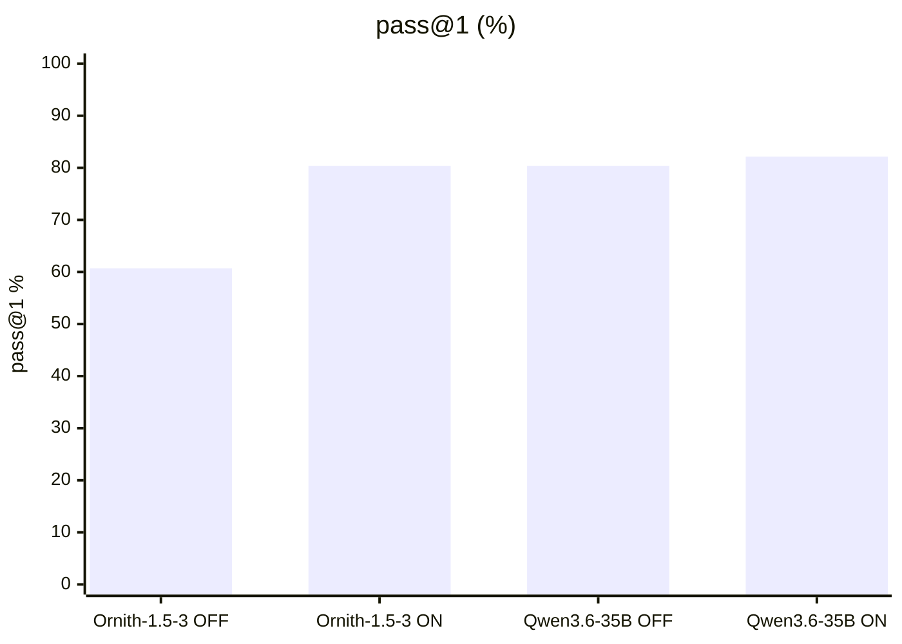
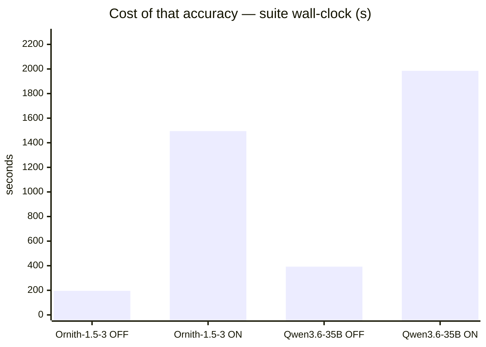
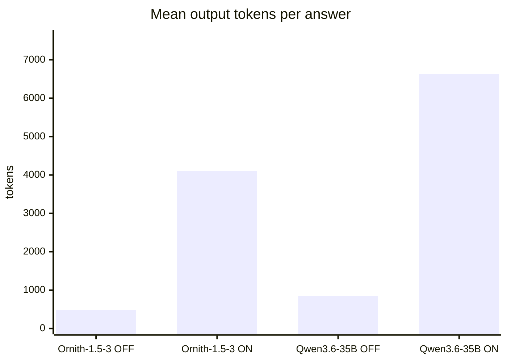
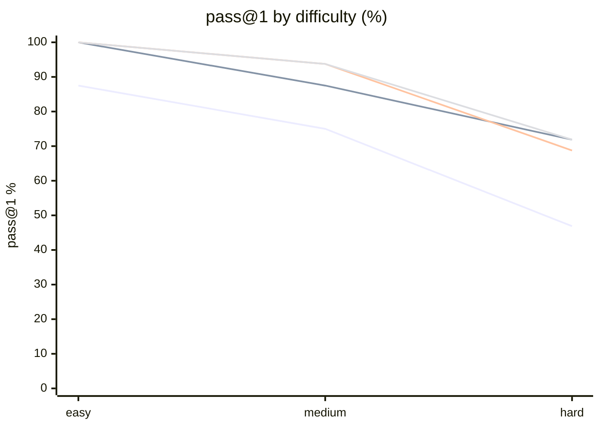

# Ornith-1.5-35B-A3B vs Qwen3.6-35B-A3B

**Question.** Should Ornith-1.5-35B-A3B replace Qwen3.6-35B-A3B behind `montimage-dgx-spark`?

**Verdict.** No. It ties at its best setting and loses 20 points at the setting we actually deploy.

## Setup

| | |
|---|---|
| Endpoint | `http://localhost:8001` |
| Tasks | 28 |
| Samples per task | 2 (⇒ 56 generations per run) |
| Concurrency | 4 |
| Metric | pass@1 over hidden executable unit tests |

## Results

| Run | pass@1 | easy | medium | hard | Wall | Mean out tok | Truncated | tok/s |
|---|---|---|---|---|---|---|---|---|
| Ornith-1.5 think-OFF 6k | 60.7 % | 87.5 % | 75.0 % | 46.9 % | 196 s | 476 | 0 | 36.5 |
| Ornith-1.5 think-ON 16k | 80.4 % | 100.0 % | 87.5 % | 71.9 % | 1,495 s | 4,098 | 8 | 38.9 |
| Qwen3.6 think-OFF 6k | 80.4 % | 100.0 % | 93.8 % | 68.8 % | 392 s | 852 | 0 | 34.5 |
| **Qwen3.6 think-ON 16k** | 82.1 % | 100.0 % | 93.8 % | 71.9 % | 1,985 s | 6,631 | 1 | 47.8 |

Line 1 = Ornith-1.5 think-OFF 6k · Line 2 = Ornith-1.5 think-ON 16k · Line 3 = Qwen3.6 think-OFF 6k · Line 4 = Qwen3.6 think-ON 16k

## Where they disagree — Qwen3.6 think-ON 16k vs Ornith-1.5 think-ON 16k

| Task | Qwen3.6 think-ON 16k | Ornith-1.5 think-ON 16k | Winner |
|---|---|---|---|
| `cron_next` | 50 % | 0 % | Qwen3.6 think-ON 16k |
| `diff_lines` | 50 % | 100 % | Ornith-1.5 think-ON 16k |
| `range_module` | 0 % | 100 % | Ornith-1.5 think-ON 16k |
| `regex_match` | 100 % | 50 % | Qwen3.6 think-ON 16k |
| `running_median` | 100 % | 0 % | Qwen3.6 think-ON 16k |
| `tx_dict` | 50 % | 100 % | Ornith-1.5 think-ON 16k |
| `version_cmp` | 50 % | 100 % | Ornith-1.5 think-ON 16k |
| `wrap_min_raggedness` | 100 % | 0 % | Qwen3.6 think-ON 16k |

## Reading the numbers

**Ornith needs its reasoning block; Qwen3.6 does not.** Turning thinking off costs
Ornith 19.7 points (80.4 → 60.7) and it starts failing *easy* tasks. Qwen3.6 loses
only 1.7 points. The deployed coding-agent recipe runs thinking off, so at the config
actually in production the swap would be a 20-point regression.

**With thinking on, it is a tie, not a win.** 80.4 % vs 82.1 % over 56 generations is
inside the noise. Per-task the two trade blows evenly.

**Ornith is cheaper per answer but less stable.** Same score with 38 % fewer output
tokens and 25 % less wall time — but it hit the 16k cap on 8 of 56 generations versus
1 for Qwen3.6. That runaway-reasoning failure mode is exactly what hangs a coding agent.

**The vendor's benchmark table did not transfer.** The model card claims large wins over
Qwen3.6-35B-A3B on Terminal-Bench and SWE-bench. On this suite, at NVFP4 on GB10, that
gap does not appear.

**Ornith is a genuine drop-in.** Same `qwen3_5_moe` architecture, same `<think>` tags and
`enable_thinking` kwarg, same `qwen3_coder` XML tool-call format; MTP speculative decoding
worked at ~2.1 mean acceptance length. Only `MODEL_ID` changed — see
`configs/ornith-1.5-35b-a3b-nvfp4.sh` if you want to retry it.

## Caveats

- 2 samples per task. Differences under ~8 points are noise, not signal.
- Single-turn Python code generation only. Multi-turn agentic tool use is not exercised here.
- A truncated generation counts as a failure; a high `Truncated` column means runaway reasoning, which hangs real agents.

## Raw data

- `run-ornith-15-think-off-6k.json` — Ornith-1.5 think-OFF 6k
- `run-ornith-15-think-on-16k.json` — Ornith-1.5 think-ON 16k
- `run-qwen36-think-off-6k.json` — Qwen3.6 think-OFF 6k
- `run-qwen36-think-on-16k.json` — Qwen3.6 think-ON 16k
