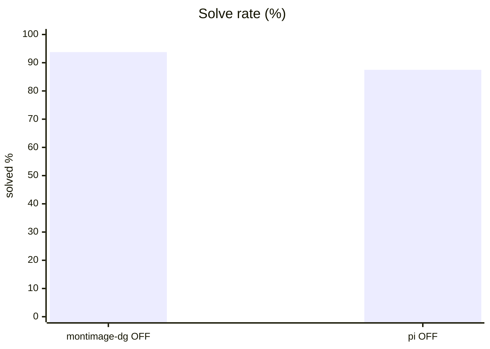
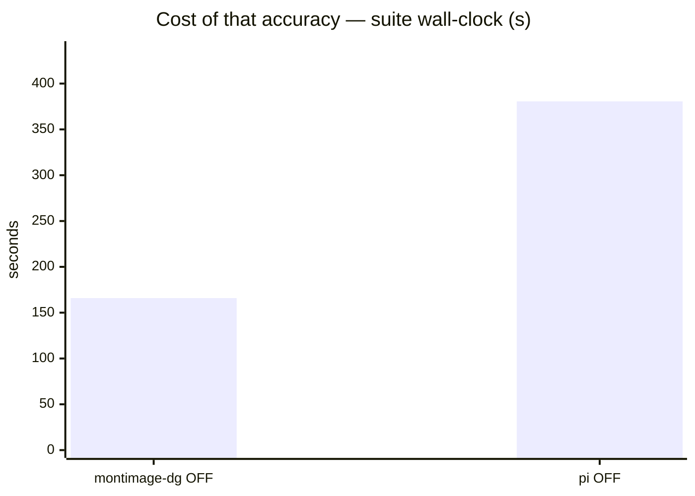
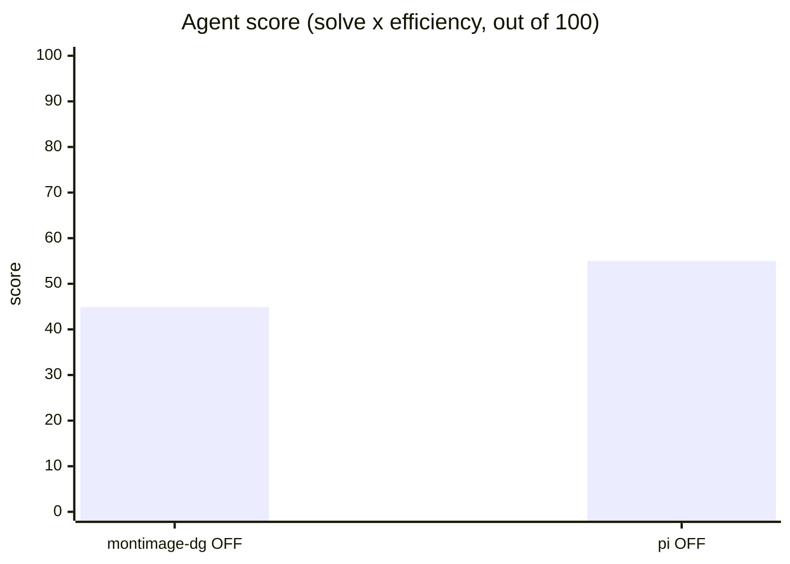
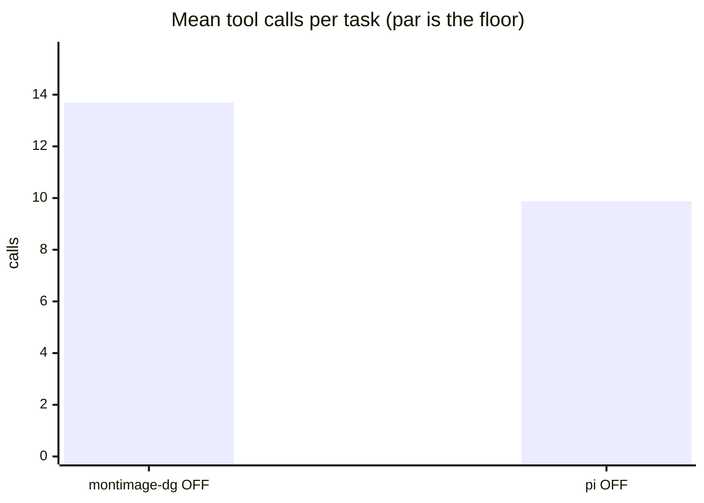
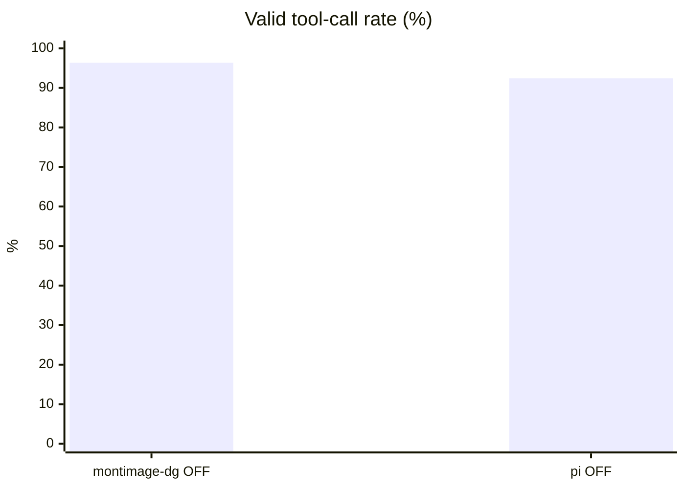
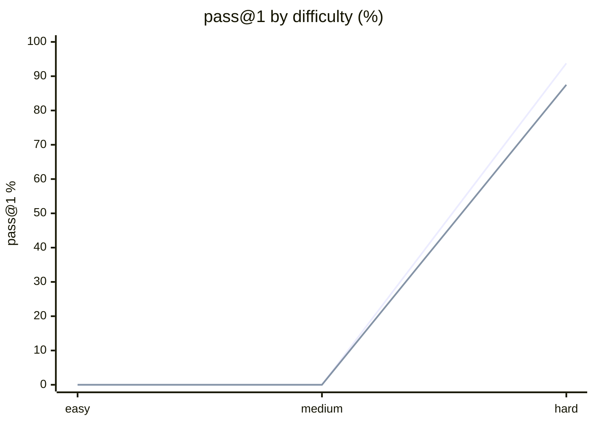

# Harness comparison on the ranking suite — pi vs benchkit's tool loop

**Question.** On tasks that can still be failed, does the harness change the ranking?

**Verdict.** Yes, and it inverts: pi solves fewer tasks (87.5 % vs 93.8 %) but uses a third fewer tool calls, scoring 55.0 against 44.9.

## Setup

| | |
|---|---|
| Endpoint | `http://localhost:8001/v1` |
| Tasks | 8 |
| Samples per task | 2 (⇒ 16 generations per run) |
| Concurrency | 4 |
| Metric | pass@1 over hidden executable unit tests |

## Results

| Run | Agent score | Solved | Efficiency | Mean calls | Par | Valid calls | Turn-limit | Wall |
|---|---|---|---|---|---|---|---|---|
| benchkit loop + Qwen3.6 think-OFF | 44.9 | 93.8 % | 47.9 % | 13.7 | 5.9 | 96.3 % | 0 | 166 s |
| **pi harness + Qwen3.6 think-OFF** | **55.0** | 87.5 % | 62.9 % | 9.9 | 5.9 | 92.4 % | 0 | 381 s |

**Agent score** = solve rate x efficiency, out of 100 — solving is the price of entry, efficiency breaks the ties solve rate cannot. *Efficiency* = par tool calls / calls actually used, capped at 1 and counted only on solved tasks. *Par* is measured by running each task's oracle, so it does not depend on the model. *Valid calls* = calls that did not error. *Turn-limit* = runs abandoned without finishing.

Line 1 = benchkit loop + Qwen3.6 think-OFF · Line 2 = pi harness + Qwen3.6 think-OFF

## Where they disagree — benchkit loop + Qwen3.6 think-OFF vs pi harness + Qwen3.6 think-OFF

| Task | benchkit loop + Qwen3.6 think-OFF | pi harness + Qwen3.6 think-OFF | Winner |
|---|---|---|---|
| `hidden_spec_compliance` | 100 % | 50 % | benchkit loop + Qwen3.6 think-OFF |

## Reading the numbers

**pi solves less and still scores higher, which is the metric working as designed — and worth
arguing with.** 87.5 % solved against 93.8 %, but 9.9 tool calls against 13.7 for a par of
5.9. The agent score weights efficiency enough that a lost solve is outweighed by a third
fewer calls. If you care only about whether the job gets done, read the Solved column and
ignore the score; the composite exists because on the base suite both columns read 100 % and
nothing could be ranked at all.

**The efficiency gap is the same one the base suite showed, and it is structural.** pi's
`edit` and `bash` do more per call than benchkit's `edit_file` and `run_python`, so identical
work costs fewer round trips. On the ranking suite that is 9.9 calls against 13.7; on the base
suite it was 6.0 against 7.3. This is a property of the harness, not of the model, and it is
the single clearest argument for benchmarking through the harness you actually run.

**pi pays ~119 000 input tokens per task for it.** Against ~1 300 output tokens. Whatever the
harness saves in round trips it spends in prefill, and on a metered endpoint that is the whole
bill. benchkit's own loop does not report input tokens at all — a blind spot this comparison
exists to expose, not a sign that it is cheaper.

**Both configurations failed `generalise_migration`.** The rule that duplicate names merge is
stated in FORMAT.md and absent from the sample export, so a model that infers the format from
the example rather than reading the spec produces per-row output that looks right. That task
is currently the suite's best discriminator; `hidden_spec_compliance` is second, and caught pi
on the `0033` prefix.

**A flaky test was found and fixed while running this.** `perf_budget` originally asserted an
absolute wall-clock limit, which failed a correct implementation at 2.6s against a 2.0s cap
purely because the machine was loaded. It now compares scaling between two input sizes —
quadratic work grows ~16x when n quadruples, linear work ~4x — which is load-independent.
Fixing it exposed a second bug: the original input drew from a fixed value range, so the naive
scan was O(n x distinct), linear in n, and passed. The value range now scales with n. Numbers
measured before that fix were discarded rather than published.

## Caveats

- 2 samples per task. Differences under ~8 points are noise, not signal.
- Single-turn Python code generation only. Multi-turn agentic tool use is not exercised here.
- Success is decided by a predicate over the final workspace, never by what the model claims. Every task's oracle is verified to solve it first.
- A task abandoned at the turn limit counts as failed; raise `--max-turns` before concluding the model cannot do it.

## Raw data

- `hard-benchkit-loop.json` — benchkit loop + Qwen3.6 think-OFF
- `hard-pi.json` — pi harness + Qwen3.6 think-OFF
