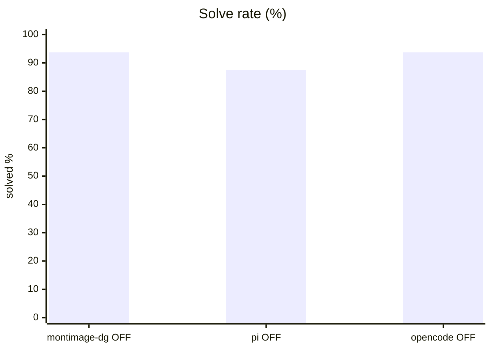
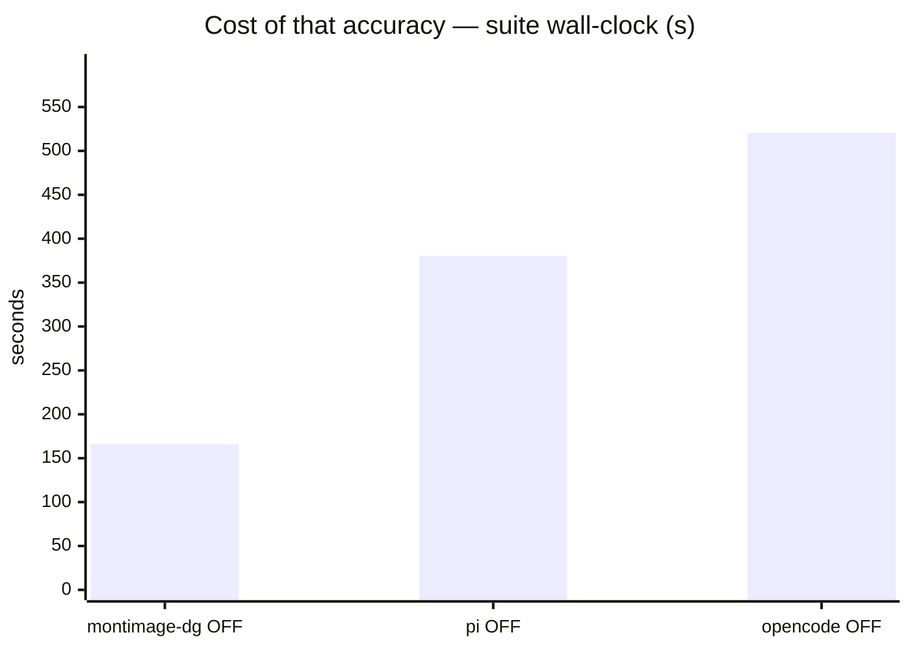
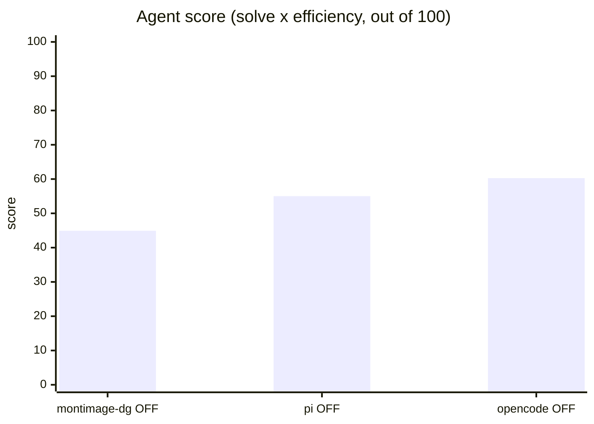
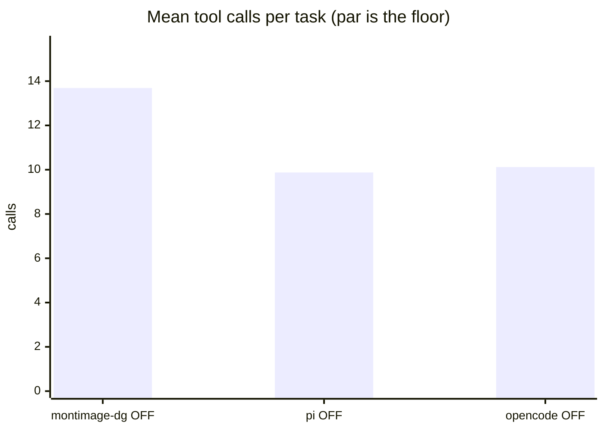
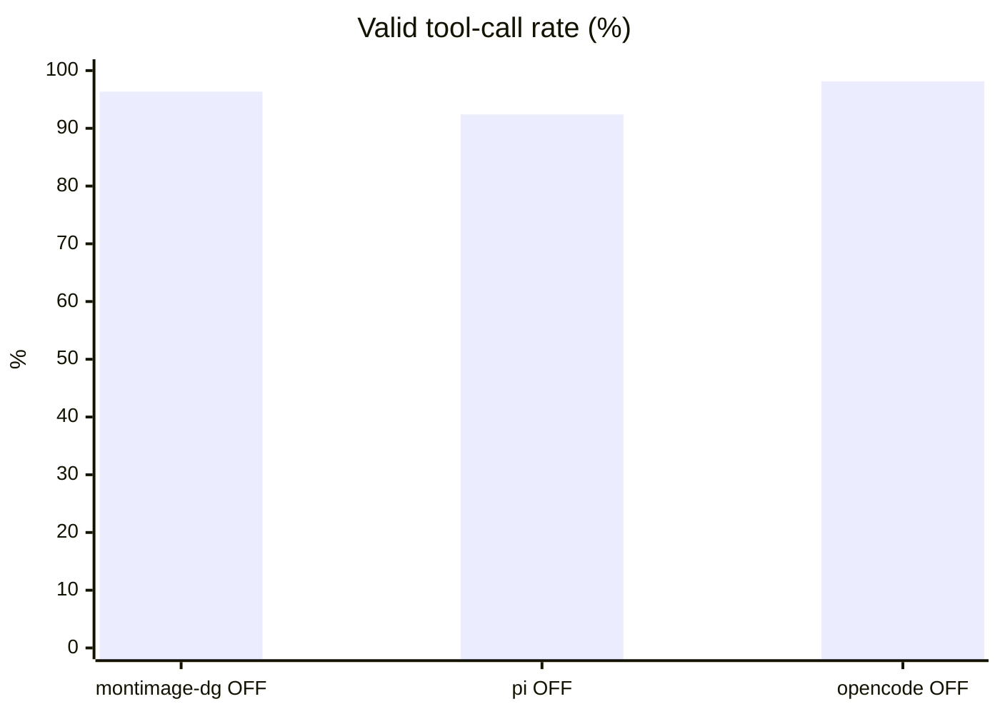
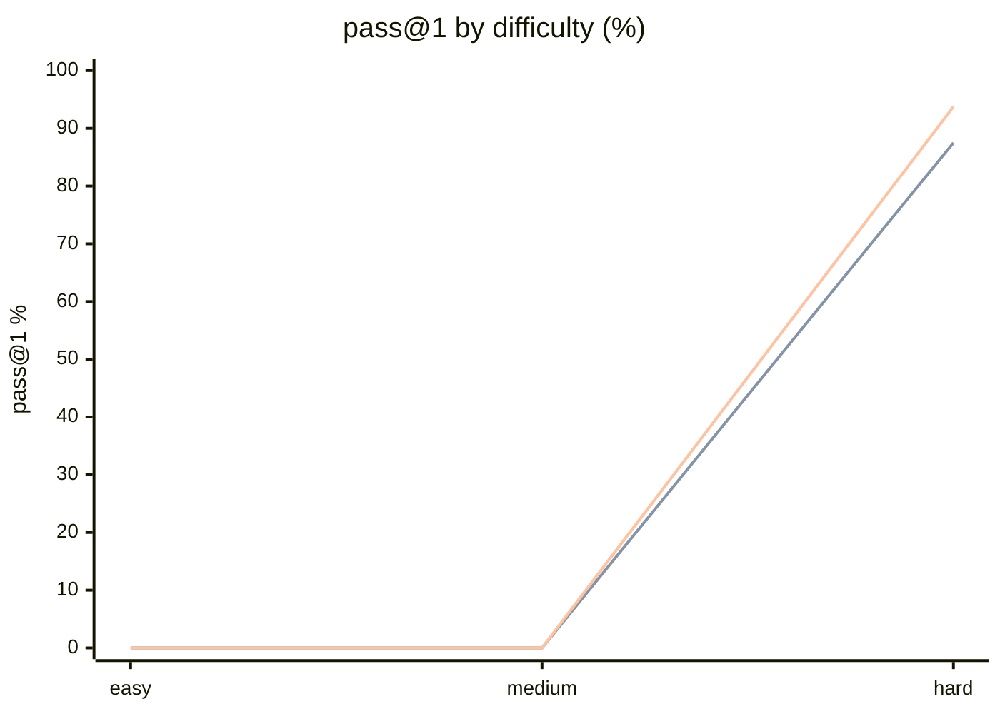

# Three harnesses on the ranking suite

**Question.** On tasks that can still be failed, does the harness change the ranking?

**Verdict.** Yes. opencode 60.3, pi 55.0, benchkit's own loop 44.9 — and only the three-way view separates pi's efficiency from the fact that it solved less to get there.

## Setup

| | |
|---|---|
| Endpoint | `http://localhost:8001/v1` |
| Tasks | 8 |
| Samples per task | 2 (⇒ 16 generations per run) |
| Concurrency | 4 |
| Metric | pass@1 over hidden executable unit tests |

## Results

| Run | Agent score | Solved | Efficiency | Mean calls | Par | Valid calls | Turn-limit | Wall |
|---|---|---|---|---|---|---|---|---|
| benchkit loop + Qwen3.6 think-OFF | 44.9 | 93.8 % | 47.9 % | 13.7 | 5.9 | 96.3 % | 0 | 166 s |
| pi harness + Qwen3.6 think-OFF | 55.0 | 87.5 % | 62.9 % | 9.9 | 5.9 | 92.4 % | 0 | 381 s |
| **opencode + Qwen3.6 think-OFF** | **60.3** | 93.8 % | 64.3 % | 10.1 | 5.9 | 98.1 % | 0 | 521 s |

**Agent score** = solve rate x efficiency, out of 100 — solving is the price of entry, efficiency breaks the ties solve rate cannot. *Efficiency* = par tool calls / calls actually used, capped at 1 and counted only on solved tasks. *Par* is measured by running each task's oracle, so it does not depend on the model. *Valid calls* = calls that did not error. *Turn-limit* = runs abandoned without finishing.

Line 1 = benchkit loop + Qwen3.6 think-OFF · Line 2 = pi harness + Qwen3.6 think-OFF · Line 3 = opencode + Qwen3.6 think-OFF

## Where they disagree — benchkit loop + Qwen3.6 think-OFF vs opencode + Qwen3.6 think-OFF

| Task | benchkit loop + Qwen3.6 think-OFF | opencode + Qwen3.6 think-OFF | Winner |
|---|---|---|---|
| `generalise_migration` | 50 % | 100 % | opencode + Qwen3.6 think-OFF |
| `hidden_spec_compliance` | 100 % | 50 % | benchkit loop + Qwen3.6 think-OFF |

## Reading the numbers

**Three harnesses, one model, one machine — and they rank differently on both suites.**
opencode leads (79.3 base, 60.3 ranking), pi is close behind, and benchkit's own tool loop is
last by a wide margin. Nothing about the model changed between these rows. Any score reported
without naming the harness is really a statement about that harness.

**opencode wins the ranking suite without giving anything up.** It matches benchkit's solve
rate (93.8 %) while using 10.1 tool calls against 13.7, and it does not pay pi's cost of
solving less: pi's higher efficiency on that suite came with 87.5 % solved. That is the one
place the three-way comparison is more informative than the two-way — it separates "efficient
because it is good" from "efficient because it gave up earlier".

**Efficiency is bought with prefill, and the ordering is exactly inverted.** Input tokens per
task: benchkit's loop does not even measure them, pi spends ~119k, opencode ~179k on the same
suite. The harness that needs the fewest round trips sends the most context per round. On a
local endpoint that trades network turns for prefill compute; on a metered API it is the whole
bill. Read the score and the token column together or the conclusion is wrong.

**Both external harnesses converge on ~7 turns where our loop takes ~9.7.** pi and opencode
have coarser tools — an `edit` that takes a whole replacement, a `bash` that can chain
commands — so identical work costs fewer round trips. This is a property of the harness, not
of the model, and it is the clearest argument for benchmarking through the one you actually
run.

**Three adapter bugs, all found by running it rather than reading it.** pi blocked forever on
an inherited stdin, so every task timed out at zero turns. opencode's project-config discovery
found the provider when the identical argv went through a shell and not when it was exec'd
directly, failing as `ProviderModelNotFoundError` a second into every task; passing
`OPENCODE_CONFIG` explicitly fixed that but moved opencode's project root to the config's
directory, after which the model reported it could not find the task files — `--dir` puts it
back. None of this is visible without a live run.

**A scoring hazard was fixed alongside.** While opencode was failing at launch it "passed"
`verify_no_change_needed`, whose predicate is satisfied by the source being untouched. A
harness that does nothing now fails every task by construction: a run that never started
cannot have solved anything.

## Caveats

- 2 samples per task. Differences under ~8 points are noise, not signal.
- Single-turn Python code generation only. Multi-turn agentic tool use is not exercised here.
- Success is decided by a predicate over the final workspace, never by what the model claims. Every task's oracle is verified to solve it first.
- A task abandoned at the turn limit counts as failed; raise `--max-turns` before concluding the model cannot do it.

## Raw data

- `hard-benchkit-loop.json` — benchkit loop + Qwen3.6 think-OFF
- `hard-pi.json` — pi harness + Qwen3.6 think-OFF
- `hard-opencode.json` — opencode + Qwen3.6 think-OFF
