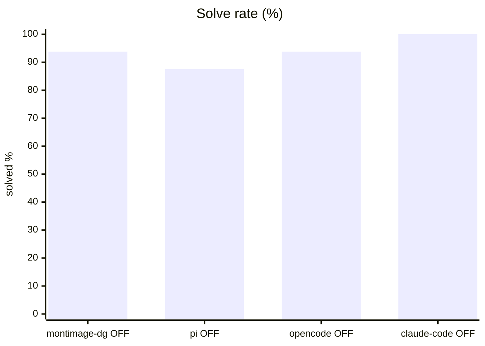
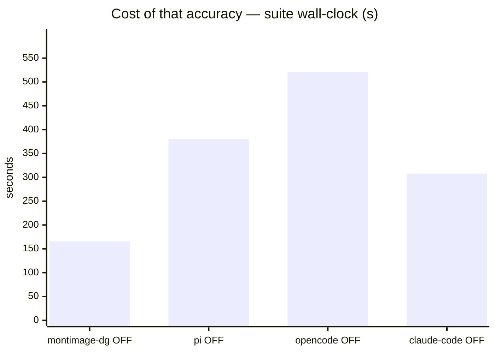
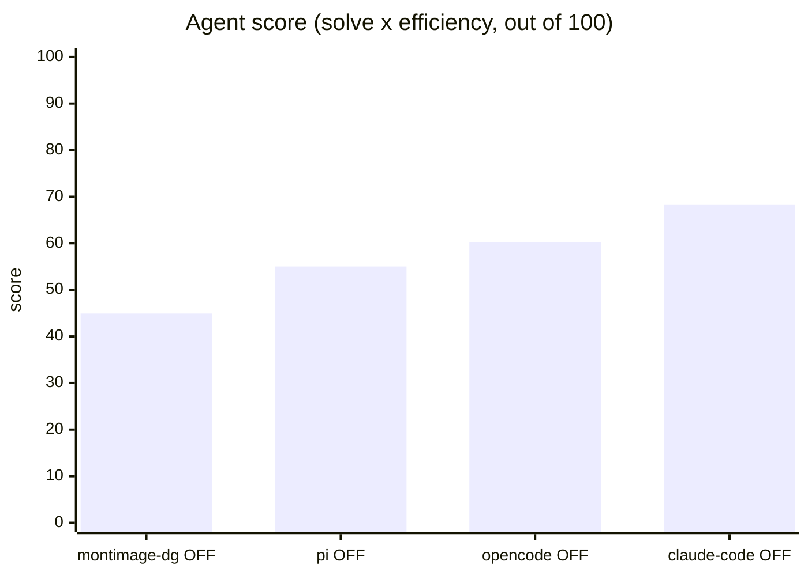
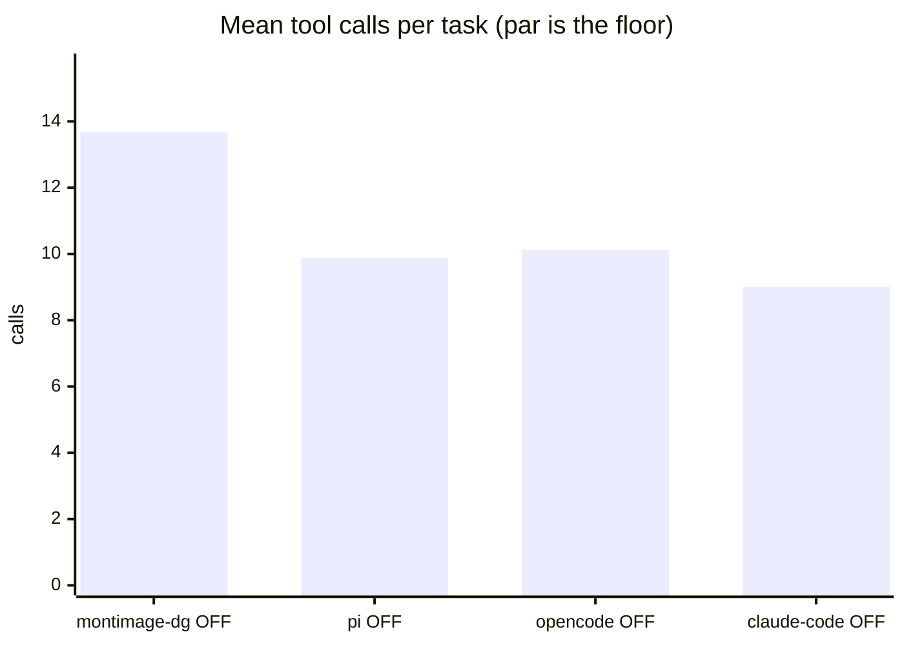
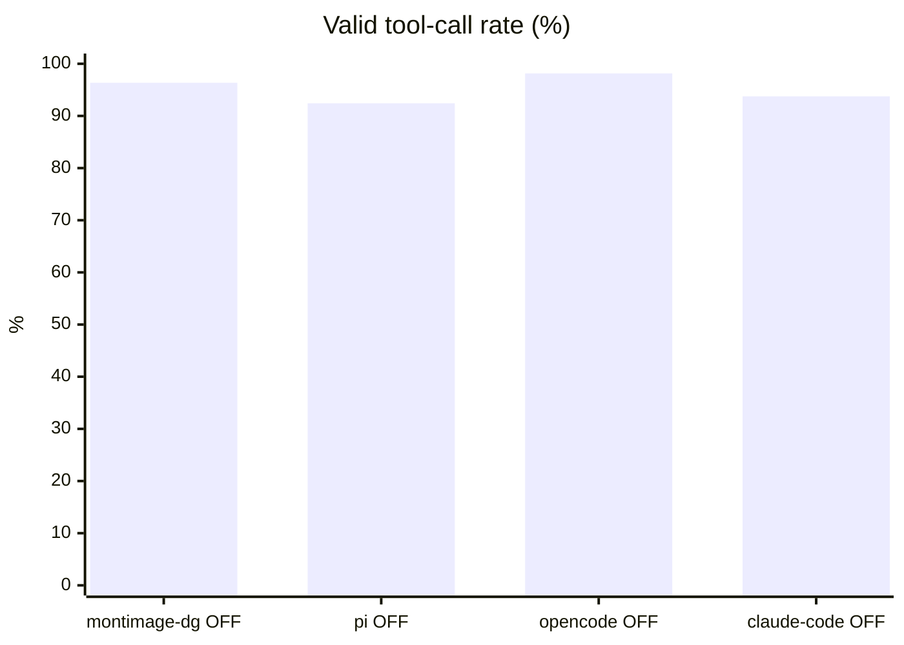
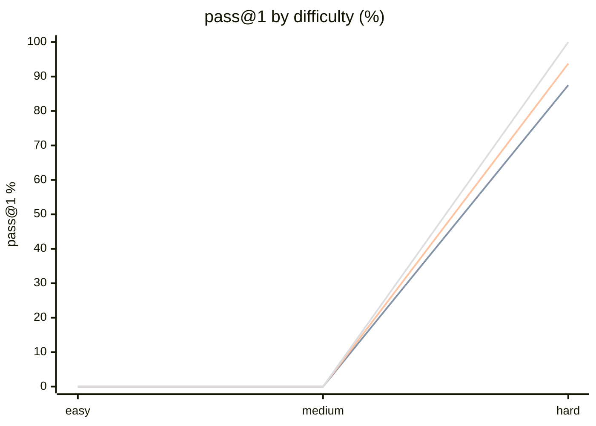

# Four harnesses on the ranking suite

**Question.** On tasks that can still be failed, does the harness change the ranking?

**Verdict.** Yes — but read the token column. claude-code 68.2, opencode 60.3, pi 55.0, benchkit's own loop 44.9: the top two are tied inside noise, and claude-code's real result is doing it on ~11x less prefill.

## Setup

| | |
|---|---|
| Endpoint | `http://localhost:8001` (not recorded for pi OFF) |
| Tasks | 8 |
| Samples per task | 2 (⇒ 16 generations per run) |
| Concurrency | mixed — 4 (montimage-dg OFF), 2 (pi OFF), 2 (opencode OFF), 2 (claude-code OFF) |
| Metric | pass@1 over hidden executable unit tests |

The runs above were **not** all collected under the same settings. Solve rate and tool-call counts are unaffected, but wall-clock is not comparable across rows that differ in concurrency, and scores from different sample counts carry different noise floors.

## Results

| Run | Agent score | Solved | Efficiency | Mean calls | Par | Valid calls | Turn-limit | Wall |
|---|---|---|---|---|---|---|---|---|
| benchkit loop + Qwen3.6 think-OFF | 44.9 | 93.8 % | 47.9 % | 13.7 | 5.9 | 96.3 % | 0 | 166 s |
| pi harness + Qwen3.6 think-OFF | 55.0 | 87.5 % | 62.9 % | 9.9 | 5.9 | 92.4 % | 0 | 381 s |
| opencode + Qwen3.6 think-OFF | 60.3 | 93.8 % | 64.3 % | 10.1 | 5.9 | 98.1 % | 0 | 521 s |
| **claude-code + Qwen3.6 think-OFF** | **68.2** | 100.0 % | 68.2 % | 9.0 | 5.9 | 93.8 % | 0 | 308 s |

**Agent score** = solve rate x efficiency, out of 100 — solving is the price of entry, efficiency breaks the ties solve rate cannot. *Efficiency* = par tool calls / calls actually used, capped at 1 and counted only on solved tasks. *Par* is measured by running each task's oracle, so it does not depend on the model. *Valid calls* = calls that did not error. *Turn-limit* = runs abandoned without finishing.

Line 1 = benchkit loop + Qwen3.6 think-OFF · Line 2 = pi harness + Qwen3.6 think-OFF · Line 3 = opencode + Qwen3.6 think-OFF · Line 4 = claude-code + Qwen3.6 think-OFF

## Where they disagree — claude-code + Qwen3.6 think-OFF vs benchkit loop + Qwen3.6 think-OFF

| Task | claude-code + Qwen3.6 think-OFF | benchkit loop + Qwen3.6 think-OFF | Winner |
|---|---|---|---|
| `generalise_migration` | 100 % | 50 % | claude-code + Qwen3.6 think-OFF |

## Reading the numbers

**Four harnesses, one model, one machine — and they still rank differently.**
claude-code 68.2, opencode 60.3, pi 55.0, benchkit's own tool loop 44.9. Nothing about the
model changed between these rows: same endpoint, same weights, same think-OFF setting, same 8
tasks. Any score reported without naming the harness is really a statement about that harness.

**claude-code is the only run that solved every generation.** 16/16, where opencode and
benchkit's loop each dropped one and pi dropped two. It reached that with 9.0 tool calls
against a par of 5.9 — the fewest of the four — so this is not pi's pattern. pi's efficiency on
this suite (62.9 %) was bought by solving 87.5 %; claude-code's 68.2 % efficiency comes with
100 % solved. That is the distinction the multi-way view exists to make: efficient because it
is good, not efficient because it gave up earlier.

**But 68.2 over opencode's 60.3 is not yet a win.** At 2 samples over 8 tasks, one generation
is 6.25 points. The 7.9-point score gap and the 6.2-point solve-rate gap are both inside the
noise band this suite can resolve; the honest reading is that claude-code and opencode are
tied at the top and the two weaker harnesses are separated from them. Do not promote
claude-code to "best harness" on this table. More samples, not more prose, is what would
settle it.

**The prefill result, however, is structural — and it inverts the earlier story.** Input
tokens per task: claude-code ~15.9k, pi ~119k, opencode ~179k. That is a 7x gap to pi and an
11x gap to opencode, far too large to be sampling noise over 16 generations. The previous
three-way report concluded that efficiency in this suite is bought with prefill and that the
harness needing the fewest round trips sends the most context per round. claude-code breaks
that trade: it has the fewest calls *and* by far the smallest context per call. On a local
endpoint that is wall-clock (308 s against opencode's 521 s at identical concurrency); on a
metered API it is the entire bill, an order of magnitude of it.

**What does not follow from any of this.** These numbers do not say claude-code is a better
agent than opencode — the score gap is inside noise. They do not say the model got better;
the model never changed. They do not transfer to the base suite: the claude-code base run in
`REPORT.md` was taken at samples 1 / concurrency 1 and is not comparable to the rows beside
it, which is why that report is left alone rather than quietly restated. And an 8-task suite
that everything now passes at least 87.5 % of the time is close to saturating — the ranking
suite is running out of headroom to separate the top two, which is a fact about the suite, not
about the harnesses.

**One methodology wrinkle to keep visible.** The benchkit-loop row was collected at
concurrency 4; the three external harnesses all ran at concurrency 2. That does not move solve
rate or call counts, but it makes the loop's 166 s wall-clock not directly comparable to the
other three wall figures.

**Adapter bugs, all found by running it rather than reading it.** pi blocked forever on an
inherited stdin, so every task timed out at zero turns. opencode's project-config discovery
found the provider when the identical argv went through a shell and not when it was exec'd
directly, failing as `ProviderModelNotFoundError` a second into every task; passing
`OPENCODE_CONFIG` explicitly fixed that but moved opencode's project root to the config's
directory, after which the model reported it could not find the task files — `--dir` puts it
back. The claude-code adapter, which talks the Anthropic Messages API to the same endpoint,
needed no such fix. None of this is visible without a live run.

**A scoring hazard was fixed alongside.** While opencode was failing at launch it "passed"
`verify_no_change_needed`, whose predicate is satisfied by the source being untouched. A
harness that does nothing now fails every task by construction: a run that never started
cannot have solved anything.

## Caveats

- 2 samples per task. Differences under ~8 points are noise, not signal.
- Multi-turn agentic tool use against a sandboxed workspace. One-shot code generation is not exercised here.
- Success is decided by a predicate over the final workspace, never by what the model claims. Every task's oracle is verified to solve it first.
- A task abandoned at the turn limit counts as failed; raise `--max-turns` before concluding the model cannot do it.

## Raw data

- `hard-benchkit-loop.json` — benchkit loop + Qwen3.6 think-OFF
- `hard-pi.json` — pi harness + Qwen3.6 think-OFF
- `hard-opencode.json` — opencode + Qwen3.6 think-OFF
- `hard-claude-code.json` — claude-code + Qwen3.6 think-OFF
