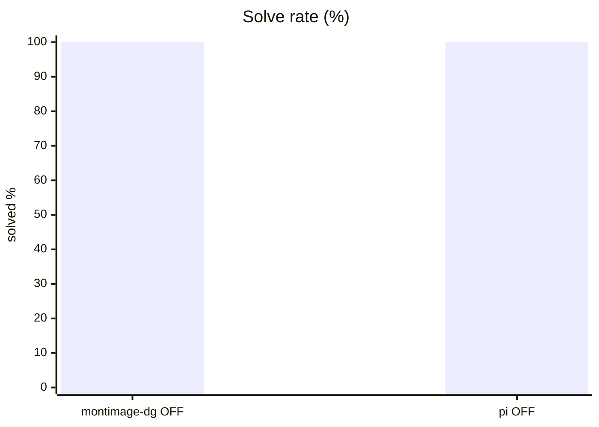
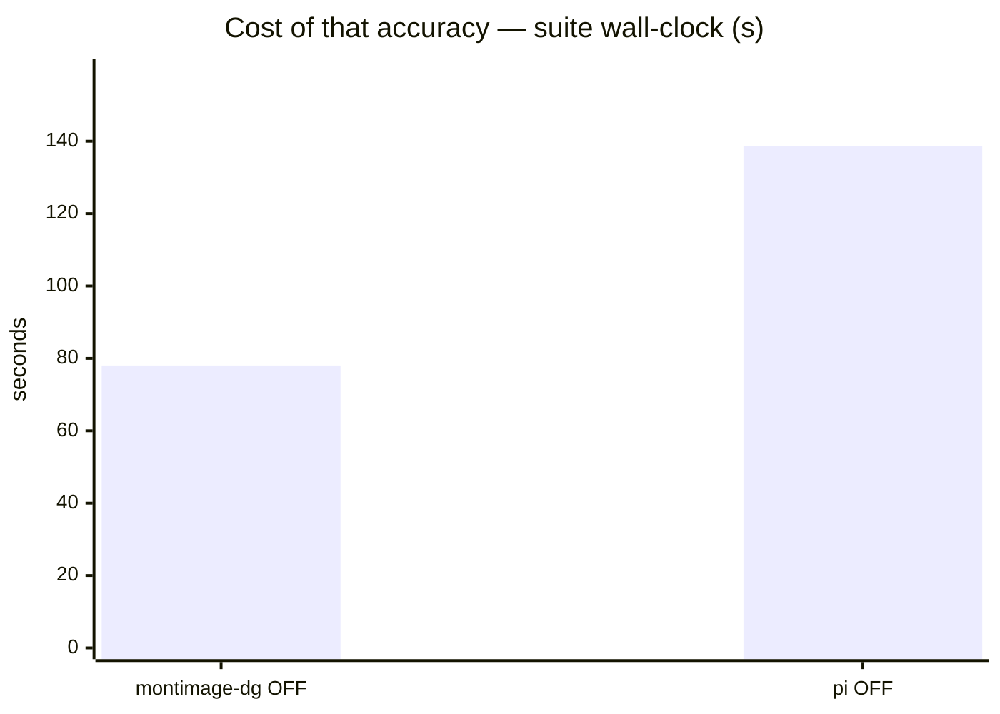
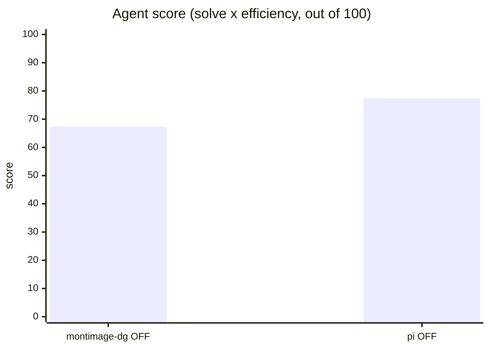
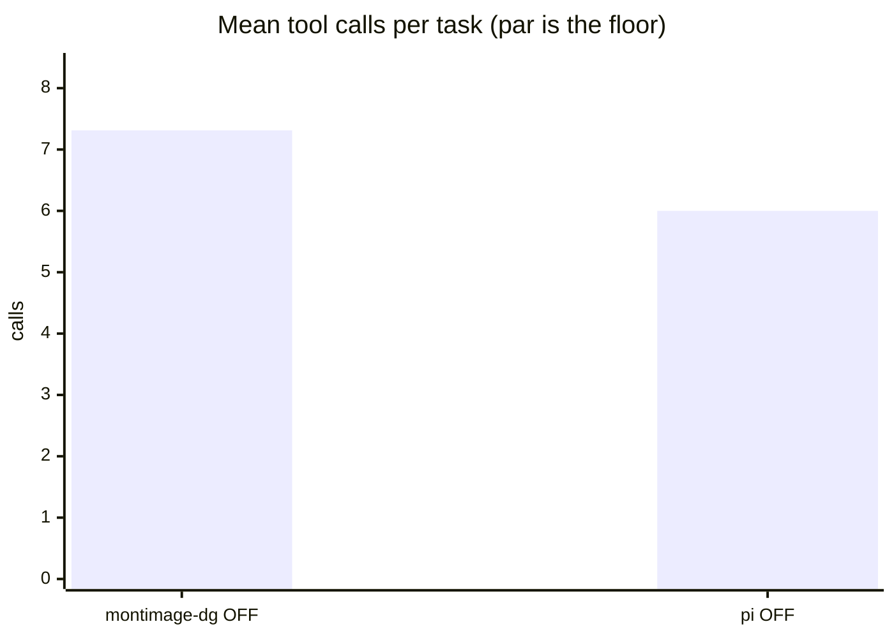
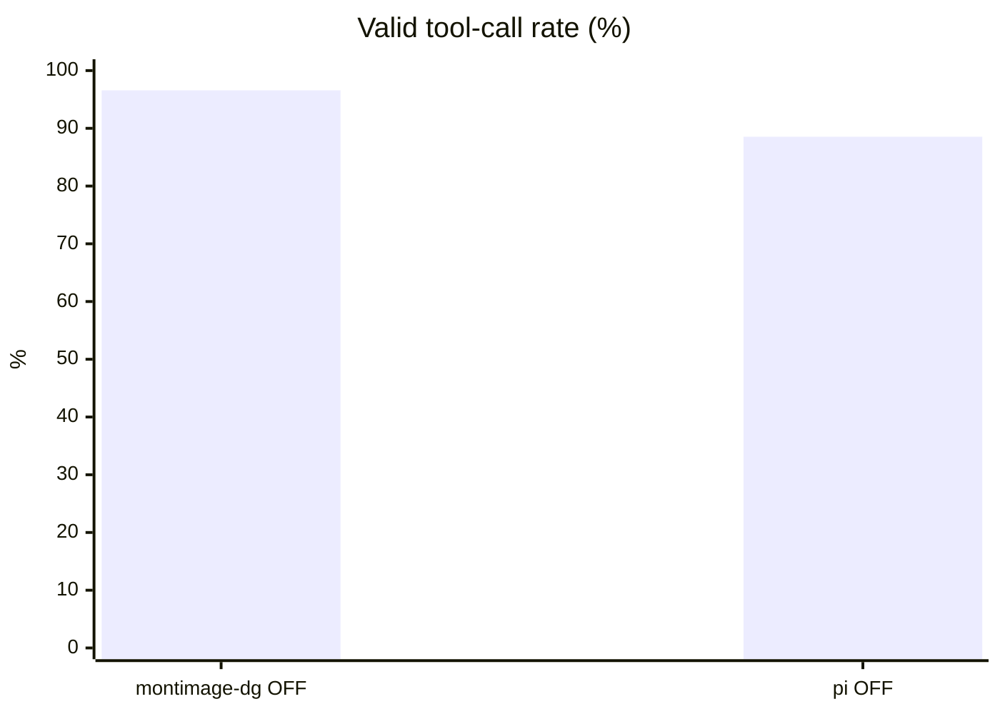

# Harness matters: pi vs benchkit's own tool loop

**Question.** Does the coding harness wrapped around a model change the answer, on the same machine and the same model?

**Verdict.** Yes. Identical model and tasks score 67.4 through benchkit's loop and 77.4 through pi — entirely on efficiency, at the cost of ~91k input tokens per task.

## Setup

| | |
|---|---|
| Endpoint | `http://localhost:8001/v1` |
| Tasks | 8 |
| Samples per task | 2 (⇒ 16 generations per run) |
| Concurrency | 4 |
| Metric | pass@1 over hidden executable unit tests |

## Results

| Run | Agent score | Solved | Efficiency | Mean calls | Par | Valid calls | Turn-limit | Wall |
|---|---|---|---|---|---|---|---|---|
| benchkit loop + Qwen3.6 think-OFF | 67.4 | 100.0 % | 67.4 % | 7.3 | 4.6 | 96.6 % | 0 | 78 s |
| **pi harness + Qwen3.6 think-OFF** | **77.4** | 100.0 % | 77.4 % | 6.0 | 4.6 | 88.5 % | 0 | 139 s |

<sub>**Agent score** = solve rate x efficiency, out of 100 — solving is the price of entry, efficiency breaks the ties solve rate cannot. *Efficiency* = par tool calls / calls actually used, capped at 1 and counted only on solved tasks. *Par* is measured by running each task's oracle, so it does not depend on the model. *Valid calls* = calls that did not error. *Turn-limit* = runs abandoned without finishing.</sub>











```mermaid
xychart-beta
    title "pass@1 by difficulty (%)"
    x-axis ["easy", "medium", "hard"]
    y-axis "pass@1 %" 0 --> 100
    line [100, 100, 100]
    line [100, 100, 100]
```

<sub>Line 1 = benchkit loop + Qwen3.6 think-OFF · Line 2 = pi harness + Qwen3.6 think-OFF</sub>

## Reading the numbers

**The harness moves the score as much as a model swap does.** Same weights, same tasks, same
machine: 67.4 through benchkit's own tool loop, 77.4 through pi. Both solve everything, so
the entire gap is efficiency — 6.0 tool calls against 7.3, against a par of 4.6. Any number
in this repo that does not name a harness is really a statement about *that* harness.

**pi is closer to par because its tools are coarser.** Its `edit` and `bash` do more per
call than our `edit_file` and `run_python`, so the same work costs fewer calls. That is a
real advantage for a user — fewer round trips, less latency — but it is also why call counts
alone cannot rank harnesses. Read them next to the token columns.

**The token columns are the reason.** pi spends ~91 000 input tokens per task against ~600
output. That is its system prompt, tool schemas and resent context, and it dwarfs everything
the model generates. On a local endpoint it costs prefill time; on a metered API it is the
entire bill. benchkit's own loop does not report input tokens at all, which is precisely the
kind of blind spot this comparison exists to expose.

**Two adapter bugs were found by running it, not by reading it.** pi blocked forever on an
inherited stdin, so every task timed out at zero turns — indistinguishable, from the outside,
from a model that cannot use tools. And pi's extension system ships an advisor pointed at
`openai-codex/gpt-5.6-sol`; without `--no-extensions` a frontier model would have been
sitting inside a benchmark that claimed to measure a local one. Both are in the adapter now.

**Caveat on this campaign.** The base `agentic` suite saturates on solve rate for both, so
this ranks efficiency only. Use `agentic-hard` to compare harnesses on tasks that can still
be failed.

## Caveats

- 2 samples per task. Differences under ~8 points are noise, not signal.
- Single-turn Python code generation only. Multi-turn agentic tool use is not exercised here.
- Success is decided by a predicate over the final workspace, never by what the model claims. Every task's oracle is verified to solve it first.
- A task abandoned at the turn limit counts as failed; raise `--max-turns` before concluding the model cannot do it.

## Raw data

- `run-benchkit-loop-think-off.json` — benchkit loop + Qwen3.6 think-OFF
- `run-pi-think-off.json` — pi harness + Qwen3.6 think-OFF
