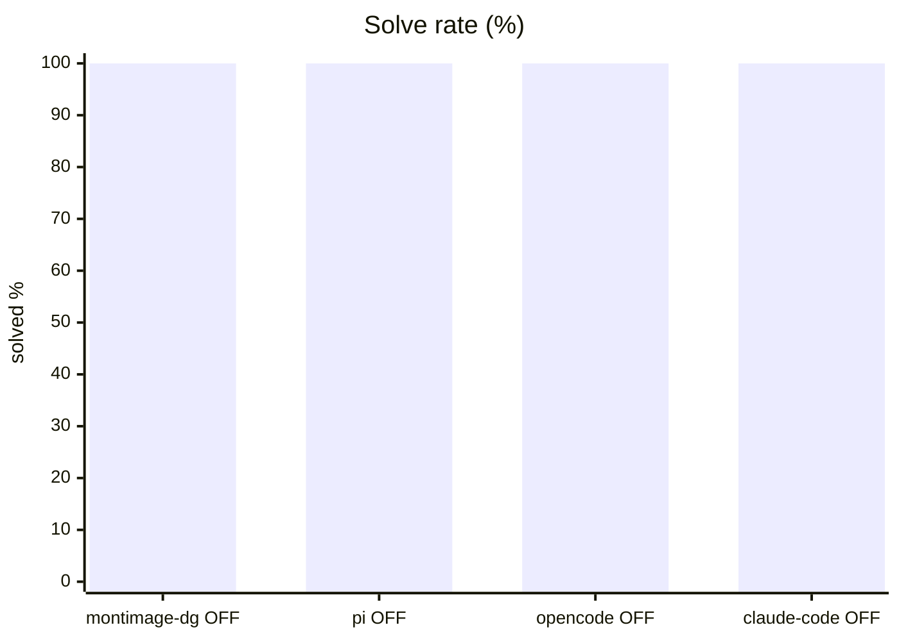
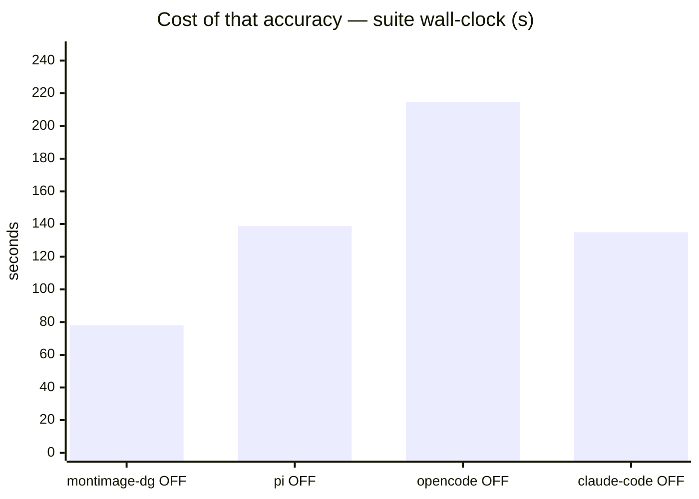
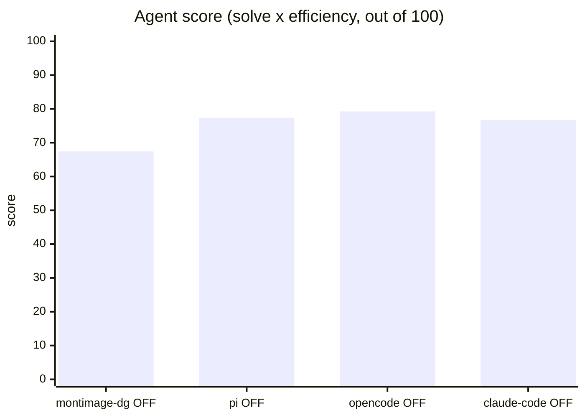
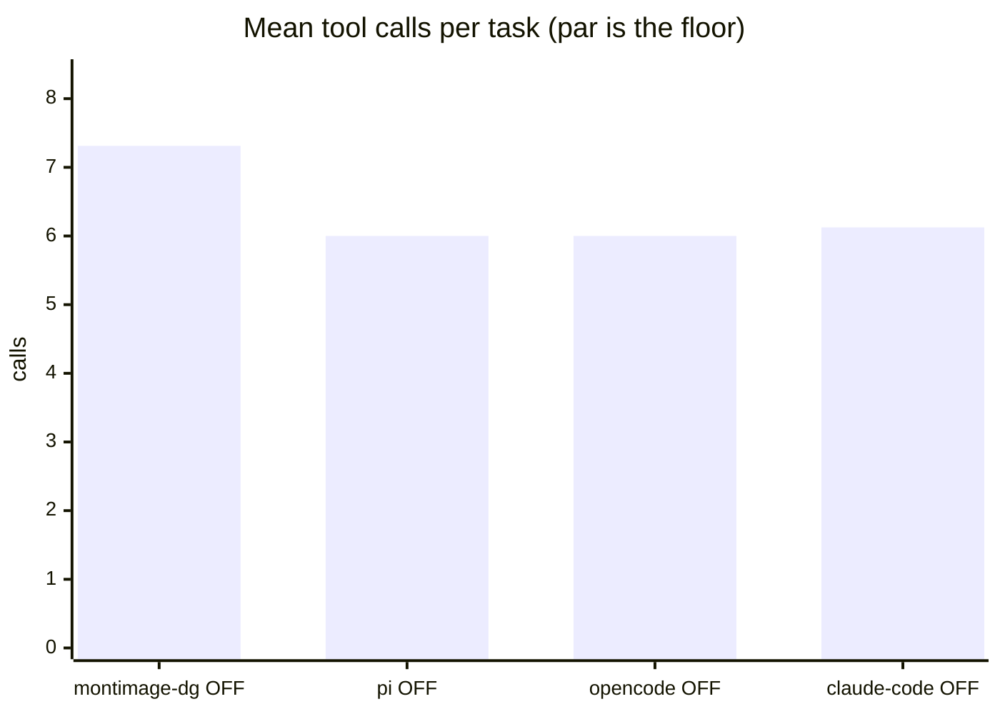
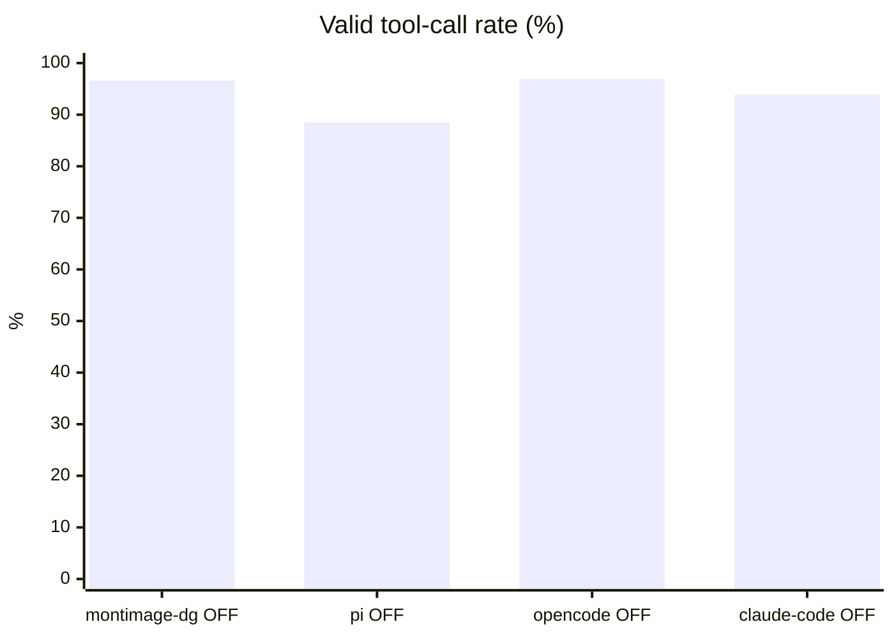

# Four harnesses, one model — the base agentic suite

**Question.** Does the coding harness wrapped around a model change the answer, on the same machine and the same model?

**Verdict.** Yes, but this suite is a floor: all four solve 100 %, so the ordering is efficiency alone — opencode 79.3, pi 77.4, claude-code 76.7, benchkit loop 67.4. The top three are tied inside noise; the real gap is prefill, ~122k / ~91k / ~9.7k input tokens per task.

## Setup

| | |
|---|---|
| Endpoint | `http://localhost:8001` (not recorded for pi OFF) |
| Tasks | 8 |
| Samples per task | 2 (⇒ 16 generations per run) |
| Concurrency | mixed — 4 (montimage-dg OFF), 2 (pi OFF), 2 (opencode OFF), 2 (claude-code OFF) |
| Metric | pass@1 over hidden executable unit tests |

<sub>The runs above were **not** all collected under the same settings. Solve rate and tool-call counts are unaffected, but wall-clock is not comparable across rows that differ in concurrency, and scores from different sample counts carry different noise floors.</sub>

## Results

| Run | Agent score | Solved | Efficiency | Mean calls | Par | Valid calls | Turn-limit | Wall |
|---|---|---|---|---|---|---|---|---|
| benchkit loop + Qwen3.6 think-OFF | 67.4 | 100.0 % | 67.4 % | 7.3 | 4.6 | 96.6 % | 0 | 78 s |
| pi harness + Qwen3.6 think-OFF | 77.4 | 100.0 % | 77.4 % | 6.0 | 4.6 | 88.5 % | 0 | 139 s |
| **opencode + Qwen3.6 think-OFF** | **79.3** | 100.0 % | 79.3 % | 6.0 | 4.6 | 96.9 % | 0 | 215 s |
| claude-code + Qwen3.6 think-OFF | 76.7 | 100.0 % | 76.7 % | 6.1 | 4.6 | 93.9 % | 0 | 135 s |

<sub>**Agent score** = solve rate x efficiency, out of 100 — solving is the price of entry, efficiency breaks the ties solve rate cannot. *Efficiency* = par tool calls / calls actually used, capped at 1 and counted only on solved tasks. *Par* is measured by running each task's oracle, so it does not depend on the model. *Valid calls* = calls that did not error. *Turn-limit* = runs abandoned without finishing.</sub>











```mermaid
xychart-beta
    title "pass@1 by difficulty (%)"
    x-axis ["easy", "medium", "hard"]
    y-axis "pass@1 %" 0 --> 100
    line [100, 100, 100]
    line [100, 100, 100]
    line [100, 100, 100]
    line [100, 100, 100]
```

<sub>Line 1 = benchkit loop + Qwen3.6 think-OFF · Line 2 = pi harness + Qwen3.6 think-OFF · Line 3 = opencode + Qwen3.6 think-OFF · Line 4 = claude-code + Qwen3.6 think-OFF</sub>

## Reading the numbers

**Four harnesses, one model, one machine — and they rank differently on both suites.**
On this base suite: opencode 79.3, pi 77.4, claude-code 76.7, benchkit's own tool loop 67.4.
Nothing about the model changed between these rows — same endpoint, same weights, same
think-OFF setting, same 8 tasks. Any score reported without naming the harness is really a
statement about that harness.

**But the top three are a tie, and this suite is a floor.** All four harnesses solve 100 % of
the base suite, so the entire ordering is efficiency and nothing else. opencode, pi and
claude-code land within 2.6 points of each other — well inside what 2 samples over 8 tasks can
resolve. The only separation this table honestly supports is that benchkit's own loop is about
10 points behind the three external harnesses. For a ranking that can actually be failed, see
`REPORT-hard.md`.

**Efficiency is bought with prefill — except for one row.** Input tokens per task on this
suite: opencode ~122k, pi ~91k, claude-code ~9.7k, and benchkit's loop does not measure them
at all. The three-way version of this report concluded that the harness needing the fewest
round trips sends the most context per round, and for pi and opencode that still holds.
claude-code does not fit it: it matches their tool-call count (6.1 against 6.0) at roughly a
tenth of the context. That is a 9x to 12x gap, far too large to be sampling noise over 16
generations, and it is the one genuinely structural difference in this table. On a local
endpoint it shows up as prefill compute; on a metered API it is the whole bill. Read the score
and the token column together or the conclusion is wrong.

**claude-code buys that with turns, not calls.** It runs ~7.1 turns against pi's 5.6 and
opencode's 5.1 while using about the same number of tool calls — more, smaller round trips
carrying far less context each. Whether that is a good trade depends entirely on what you pay
for: latency per turn, or tokens per turn.

**pi and opencode converge on ~5–6 turns where our loop takes 5.8 at 7.3 calls.** They have
coarser tools — an `edit` that takes a whole replacement, a `bash` that can chain commands —
so identical work costs fewer round trips. This is a property of the harness, not of the
model, and it is the clearest argument for benchmarking through the one you actually run.

**What does not follow from this table.** It does not name a best harness: three of the four
rows are tied. It does not say the model improved or regressed anywhere; the model never
changed. And a suite every harness passes completely cannot rank them — the base suite's job
is to establish that a harness works at all, which all four now do.

**Adapter bugs, all found by running it rather than reading it.** pi blocked forever on an
inherited stdin, so every task timed out at zero turns. opencode's project-config discovery
found the provider when the identical argv went through a shell and not when it was exec'd
directly, failing as `ProviderModelNotFoundError` a second into every task; passing
`OPENCODE_CONFIG` explicitly fixed that but moved opencode's project root to the config's
directory, after which the model reported it could not find the task files — `--dir` puts it
back. The claude-code adapter, which talks the Anthropic Messages API to the same endpoint,
needed no such fix. None of this is visible without a live run.

**A scoring hazard was fixed alongside.** While opencode was failing at launch it "passed"
`verify_no_change_needed`, whose predicate is satisfied by the source being untouched. A
harness that does nothing now fails every task by construction: a run that never started
cannot have solved anything.

**A methodology note.** The claude-code row was originally collected at samples 1 /
concurrency 1 and was excluded from this comparison for that reason; it has since been re-run
at samples 2 / concurrency 2 to match the other external harnesses, and that is the row shown
here. The benchkit-loop row is still at concurrency 4, which does not affect solve rate or call
counts but makes its 78 s wall-clock not directly comparable to the other three.

## Caveats

- 2 samples per task. Differences under ~8 points are noise, not signal.
- Multi-turn agentic tool use against a sandboxed workspace. One-shot code generation is not exercised here.
- Success is decided by a predicate over the final workspace, never by what the model claims. Every task's oracle is verified to solve it first.
- A task abandoned at the turn limit counts as failed; raise `--max-turns` before concluding the model cannot do it.

## Raw data

- `run-benchkit-loop-think-off.json` — benchkit loop + Qwen3.6 think-OFF
- `run-pi-think-off.json` — pi harness + Qwen3.6 think-OFF
- `run-opencode-think-off.json` — opencode + Qwen3.6 think-OFF
- `run-claude-code-think-off.json` — claude-code + Qwen3.6 think-OFF
