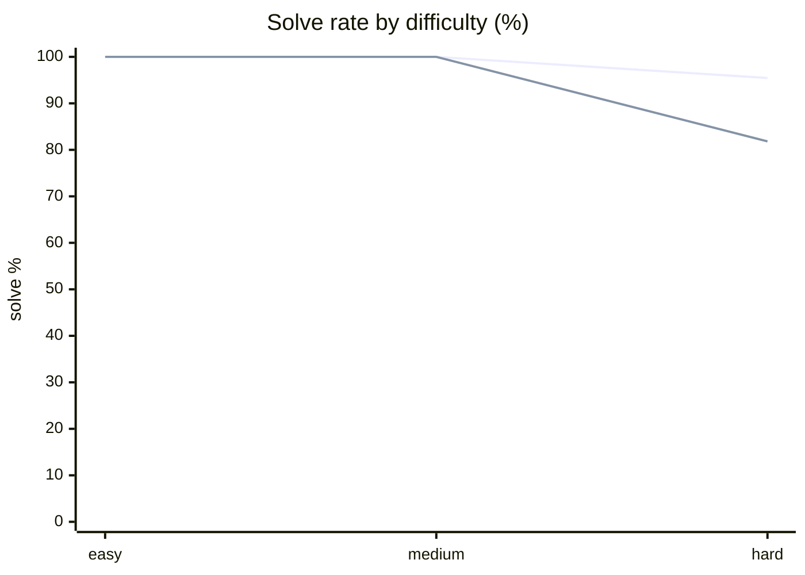
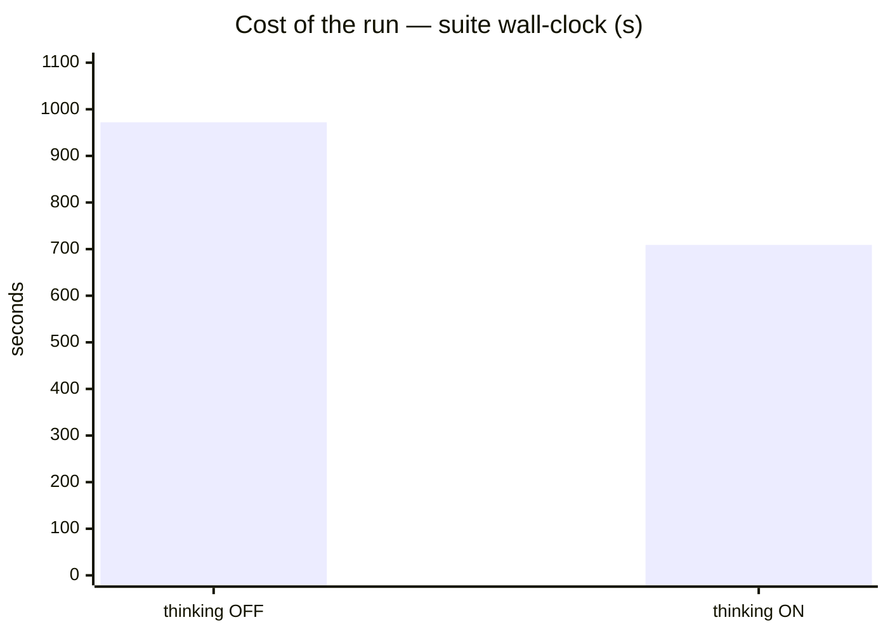
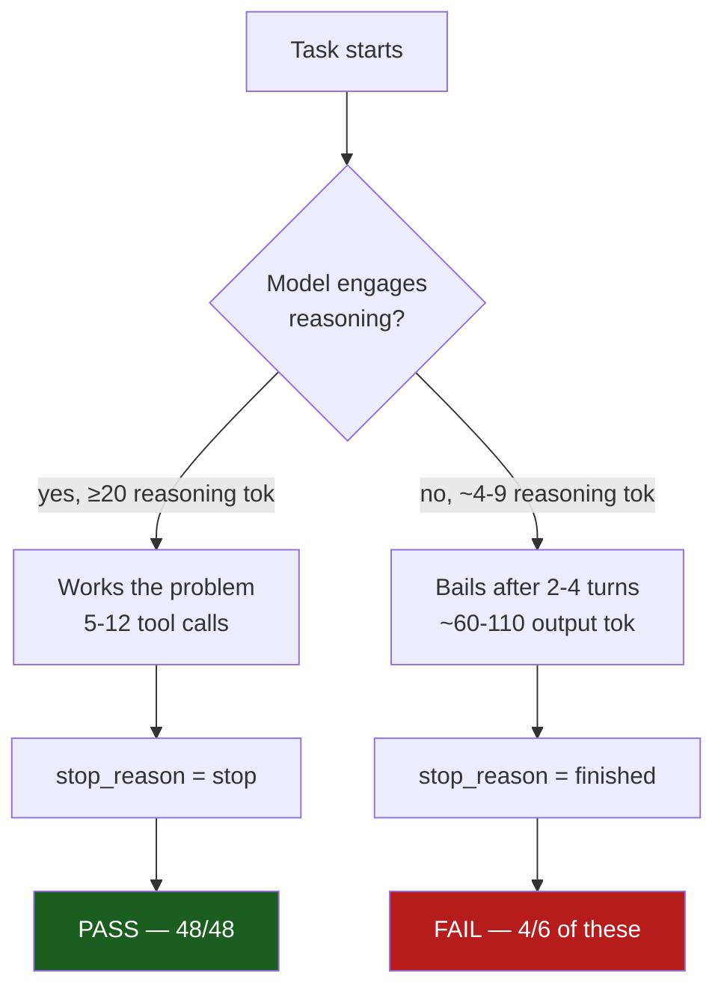
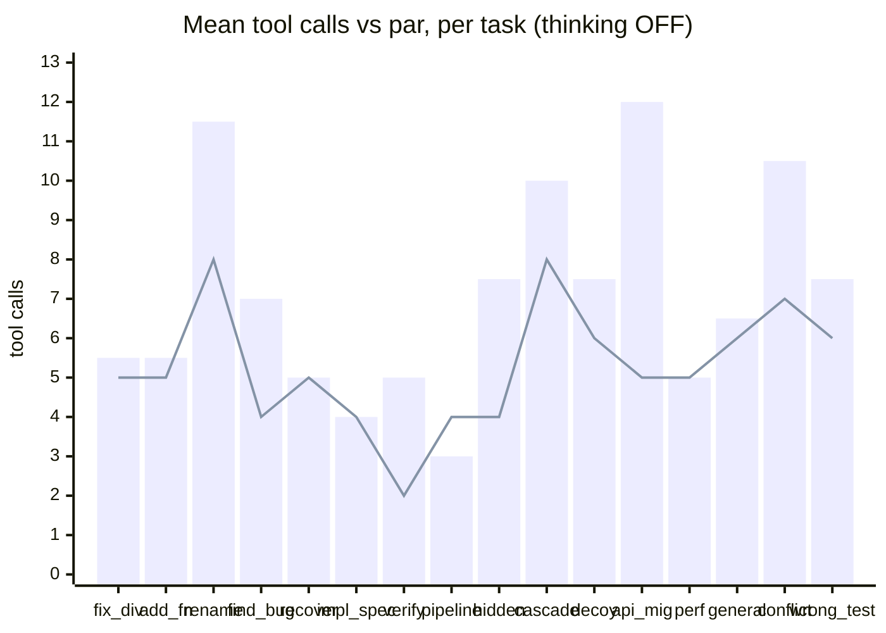

# Ox Alpha Free (`x-preview-f-free`) through the opencode harness

**Question.** How good is OpenCode Zen's stealth free model as an agentic coding model, and does its thinking mode help?

**Verdict.** Strong — 74.8 agent score, 96.9 % solve, near-perfect tool discipline. **Use it with thinking OFF.** The `--thinking` pass scores lower (70.3) and, more importantly, fails two hard tasks it otherwise solves.

## Setup

| | |
|---|---|
| Model | `opencode/x-preview-f-free` — "Ox Alpha Free (Unlimited)" |
| Model card | stealth reasoning model, 1M ctx, 131k out, `reasoning: true`, cost $0 |
| **Harness** | **opencode 1.18.20**, via the local opencode config |
| Suite | `agentic-all` — 16 tasks (4 easy/medium-tier runs, 22 hard-tier runs) |
| Samples per task | 2 (⇒ 32 generations per run) |
| Concurrency | 2 |
| Metric | agent score = solve rate × tool-call efficiency vs par |
| Date | 2026-08-21 |

Same model, same harness, same suite, both thinking modes — per the project rule that they are different products.

## Headline

| Run | Agent score | Solve | Efficiency | Calls vs par | Turns | Wall | In/out tok per task | Valid calls |
|---|---|---|---|---|---|---|---|---|
| **thinking OFF** | **74.8** | **96.9 %** | 77.2 % | 7.1 vs 5.2 | 5.8 | 972 s | 25,896 / 850 | 98.7 % |
| thinking ON | 70.3 | 87.5 % | **80.4 %** | **6.4** vs 5.2 | 5.4 | **709 s** | 32,065 / 564 | **99.0 %** |

```mermaid
xychart-beta
    title "Agent score and its two factors (%)"
    x-axis ["agent score", "solve rate", "efficiency"]
    y-axis "percent" 0 --> 100
    bar [74.83, 96.88, 77.24]
    bar [70.32, 87.50, 80.36]
```

First bar = thinking OFF, second = thinking ON.

Upper line = thinking OFF, lower = thinking ON. Both modes are saturated below hard; the whole difference lives in the hard tier.

## The score gap is noise. The failure pattern is not.

The 4.5-point score difference is **under the project's ~8-point noise floor at `--samples 2`** — do not read it as "OFF beats ON". What *is* real is which tasks broke and how consistently:

| Task | par | thinking OFF | thinking ON |
|---|---|---|---|
| `hidden_spec_compliance` | 4 | **2/2 pass** — 7.5 calls, 4,630 out tok, 175 s | **0/2 fail** — 4.0 calls, 108 out tok, 64 s |
| `perf_budget` | 5 | 1/2 pass | **0/2 fail** — 2.5 calls, 68 out tok, 88 s |

`hidden_spec_compliance` flipping 2/2 → 0/2 with a 40× collapse in output tokens is a behavioral change, not sampling variance. `perf_budget` was already the shaky task (1/2 OFF) and degrades with the same signature.

## Root cause: the failures are runs that never reasoned

Splitting every generation by whether the model emitted reasoning tokens at all:

| Run | reasoning ≥ 20 tok | reasoning < 20 tok |
|---|---|---|
| thinking OFF | 26/26 passed (100 %) | 5/6 passed |
| thinking ON | 22/22 passed (100 %) | 6/10 passed |

**Every single generation that actually reasoned, passed — 48/48 across both runs.** Every failure came from a run that emitted ~4–9 reasoning tokens and bailed.

The stop reason tells the same story. Runs ending `stop` (normal completion) vs `finished` (agent declared itself done):

| Run | `stop` | `finished` | pass rate when `finished` |
|---|---|---|---|
| thinking OFF | 30 | 2 | 1/2 |
| thinking ON | 28 | 4 | **0/4** |

The failure mode is not bad code. It is **premature self-termination**: on `hidden_spec_compliance` the model left a `NotImplementedError` stub and reported done; on `perf_budget` it produced a working but quadratic solution (scaled 14–16× when the input grew 4×) without checking the complexity requirement.

Counter-intuitively, the `--thinking` run emitted **fewer** total reasoning tokens than the default (3,069 vs 6,206) while consuming more input (32k vs 26k per task). Whatever `--thinking` maps to for this model, it made the model reason *less*, not more — and doubled the early-bail count from 2 to 4.

## Efficiency profile

Where thinking ON does win: it is genuinely tighter on the tasks it solves — 6.4 calls vs 7.1 against a par of 5.2, and 709 s vs 972 s wall. That is a real gain, paid for with the two hard-task regressions.

Bars = actual calls, line = par. Overshoot concentrates in `api_migration` (12 vs 5) and `rename_across_files` (11.5 vs 8) — multi-file edits where it re-reads more than the reference path.

Tool-call hygiene is excellent in both modes: 98.7 % / 99.0 % valid, **zero** malformed arguments, **zero** unknown tools, zero turn-limit hits, zero stalls. The only failed calls were on `recover_from_bad_path` (1 per sample, both modes) — that task deliberately baits a bad path, so recovering from one failed call is the correct behavior.

## Caveats

- **`--samples 2`.** Score differences under ~8 points are noise. The per-task flip is worth trusting; the aggregate ranking is not.
- **`--thinking` is a boolean; this model is not.** The card exposes `reasoning_options: effort ∈ {low, high, max}`. This run samples one unspecified point on that axis, so "thinking ON" here does not characterize the model's reasoning range.
- **Harness-bound.** These are opencode-loop numbers. The same model through pi or claude-code will score differently.
- **No baseline yet.** This is a standalone measurement, not a head-to-head against the incumbent `montimage-dgx-spark`.

## Recommended next steps

1. Re-run `hidden_spec_compliance` and `perf_budget` at `--samples 5` to confirm the regression.
2. Sweep reasoning effort (`low`/`high`/`max`) rather than the boolean, if the harness can pass it through.
3. Baseline against the incumbent before drawing any deployment conclusion.

## Raw data

- `results/2026-08-21/ox-alpha-free-opencode.json` — thinking OFF
- `results/2026-08-21/ox-alpha-free-opencode-thinking.json` — thinking ON
