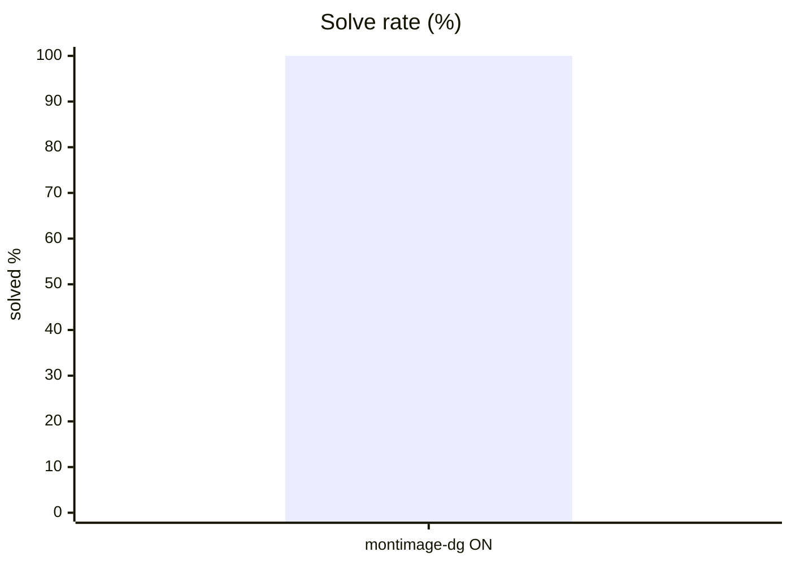
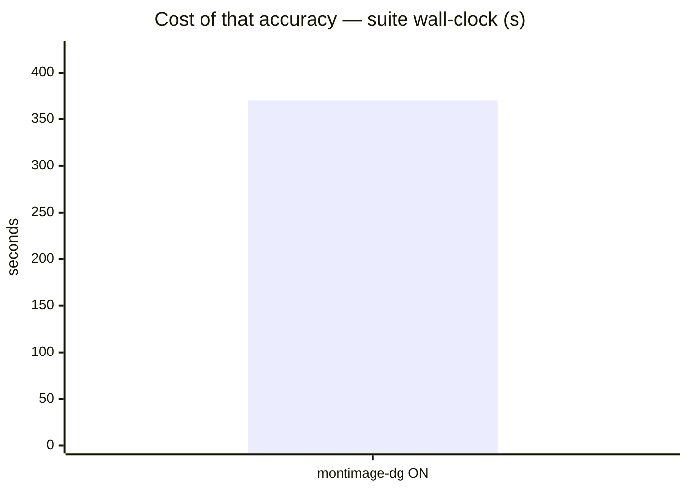
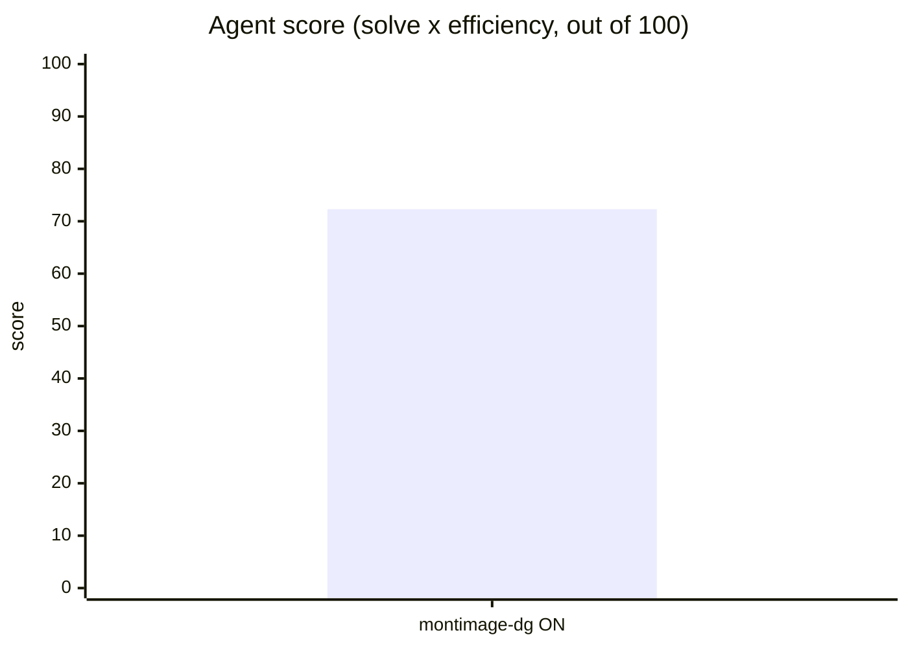
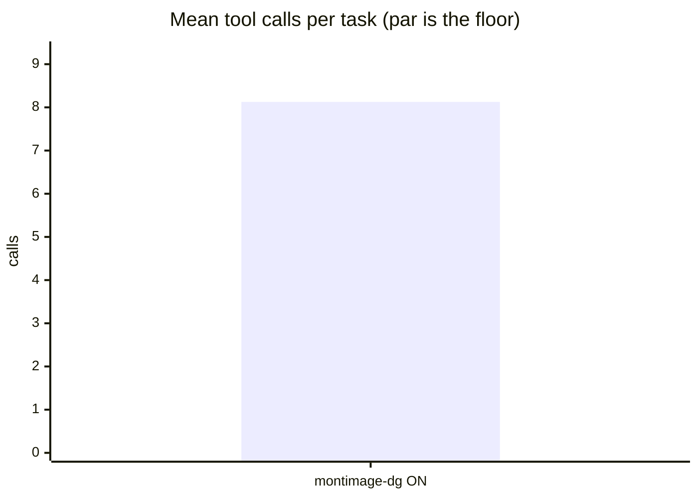
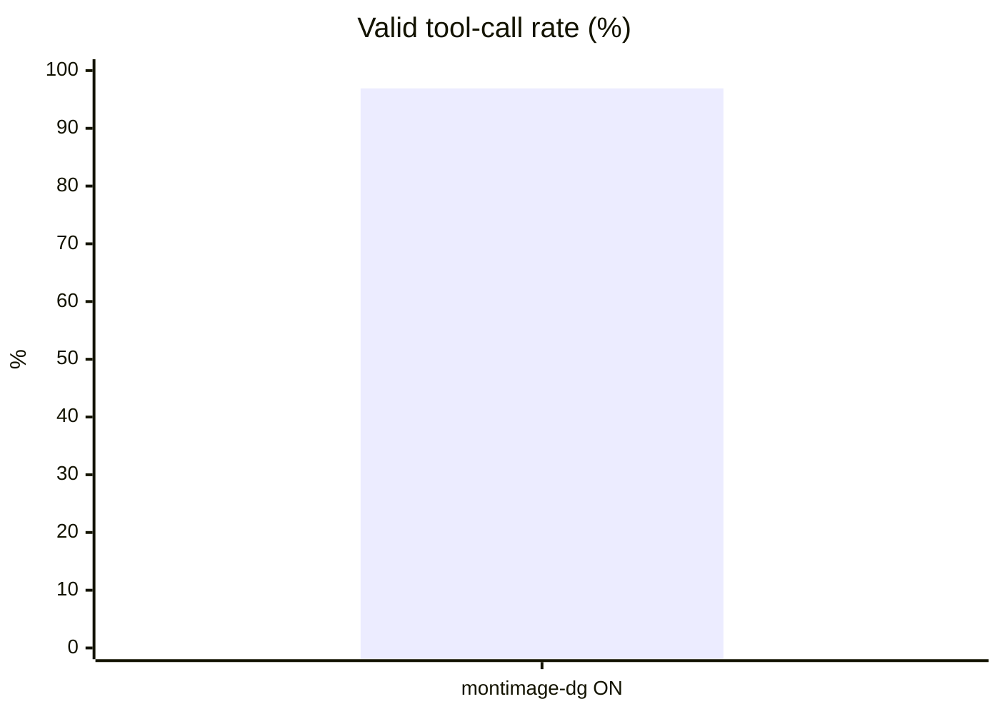
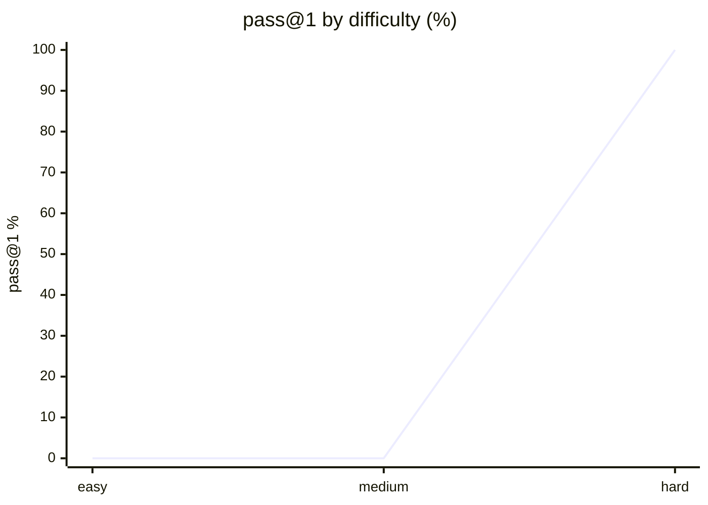

# Live setup: pi

**Question.** Is pi's current setup any good, and what should improve?

## Setup

| | |
|---|---|
| Endpoint | not recorded |
| Tasks | 8 |
| Samples per task | 1 (⇒ 8 generations per run) |
| Concurrency | 2 |
| Metric | pass@1 over hidden executable unit tests |

## Results

| Run | Agent score | Solved | Efficiency | Mean calls | Par | Valid calls | Turn-limit | Wall |
|---|---|---|---|---|---|---|---|---|
| **pi live local-dgx-montimage-dgx-spark think-ON** | **72.3** | 100.0 % | 72.3 % | 8.1 | 5.9 | 96.9 % | 0 | 370 s |

<sub>**Agent score** = solve rate x efficiency, out of 100 — solving is the price of entry, efficiency breaks the ties solve rate cannot. *Efficiency* = par tool calls / calls actually used, capped at 1 and counted only on solved tasks. *Par* is measured by running each task's oracle, so it does not depend on the model. *Valid calls* = calls that did not error. *Turn-limit* = runs abandoned without finishing.</sub>













<sub>Line 1 = pi live local-dgx-montimage-dgx-spark think-ON</sub>

## Suggestions — pi live local-dgx-montimage-dgx-spark think-ON

- Mean input tokens is **109,067 per task** — context is being resent every turn. In a live setup, audit installed **skills and MCP servers**: each one's prompt/schema rides along on every call even when unused. Disable what this work does not need.
- This was a **live-mode** run of your daily setup: extensions, skills and MCP servers were enabled. Any component that can call another model contaminates these numbers — see the caveats section.

## Caveats

- 1 samples per task. Differences under ~8 points are noise, not signal.
- Multi-turn agentic tool use against a sandboxed workspace. One-shot code generation is not exercised here.
- Success is decided by a predicate over the final workspace, never by what the model claims. Every task's oracle is verified to solve it first.
- A task abandoned at the turn limit counts as failed; raise `--max-turns` before concluding the model cannot do it.

## Raw data

- `pi-live-local-dgx-montimage-dgx-spark-think-on.1.json` — pi live local-dgx-montimage-dgx-spark think-ON
## Run context

_Collected at 2026-08-25 15:49 UTC — the conditions this result must be read against._

### Machine

| Field | Value |
|---|---|
| host | dgx-spark |
| os | Ubuntu 24.04.3 LTS 6.14.0-1013-nvidia (aarch64) |
| cpu | Cortex-X925 — 20 threads |
| memory | 120 GiB, 36 GiB free at start |
| disk | 2.7T free on / |
| load avg | 0.50 0.32 0.50 |

### GPU

| Field | Value |
|---|---|
| gpu | NVIDIA GB10 |
| vram | unified with host memory — see the memory row above |
| util | 0 % at start |
| driver | 580.95.05, CUDA 13.0 |

**Other GPU processes at start** — anything here shares the device with the run,
and a contended GPU makes wall-clock and turn counts incomparable:

```
18459, VLLM::EngineCore, 73249 MiB
```

### Serving endpoint

| Field | Value |
|---|---|
| base url | http://localhost:8001/v1 |
| serves | montimage-dgx-spark, unsloth/Qwen3.6-35B-A3B-NVFP4 |
| unit | active |

### Harness setup

A live run measures this surface, not the model alone. Every skill, MCP server and
extension below is part of the result.

| Field | Value |
|---|---|
| harness | opencode |
| model | opencode/x-preview-f-free |
| thinking | n/a |
| version | 1.18.23 |
| config | /home/montimage/.config/opencode/opencode.json |
| plugins | 1 in ~/.config/opencode/plugins |
| skills | 112 global |
| project context | CLAUDE.md AGENTS.md  |
