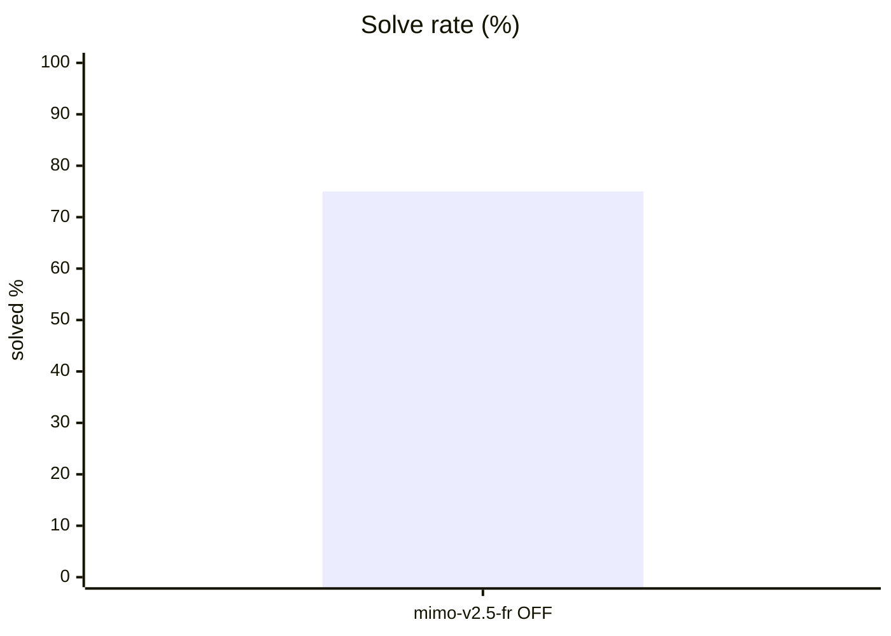
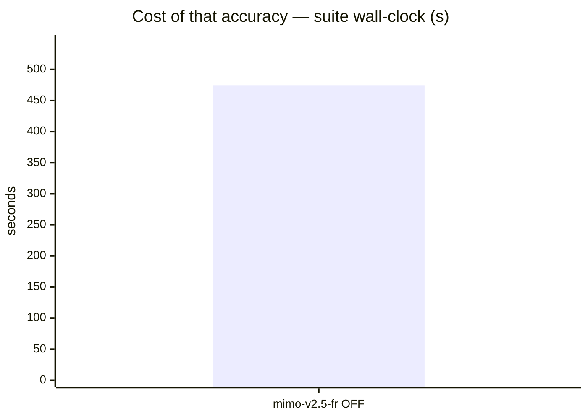
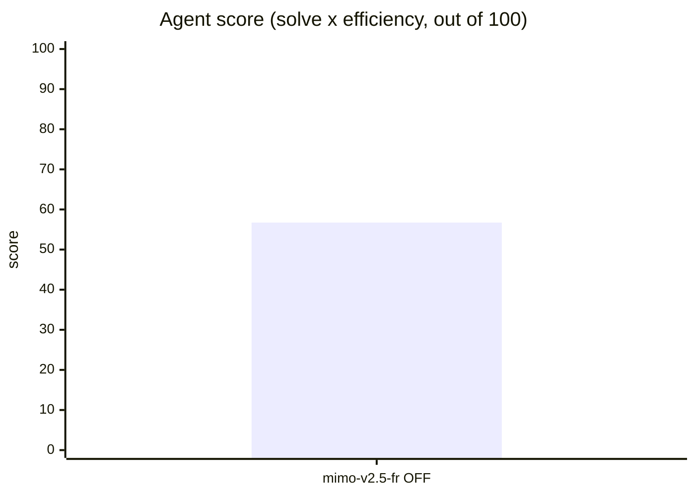
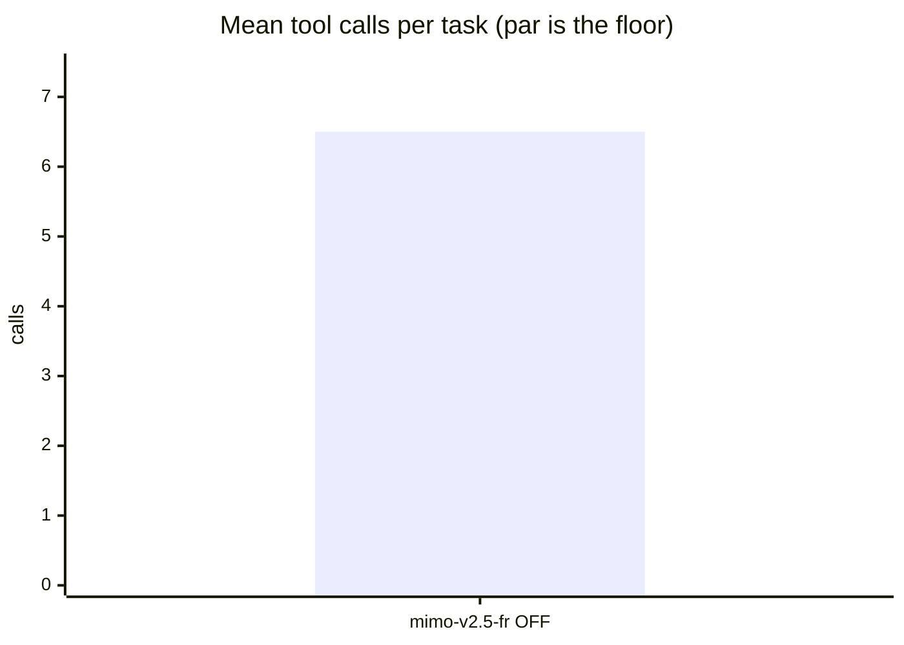
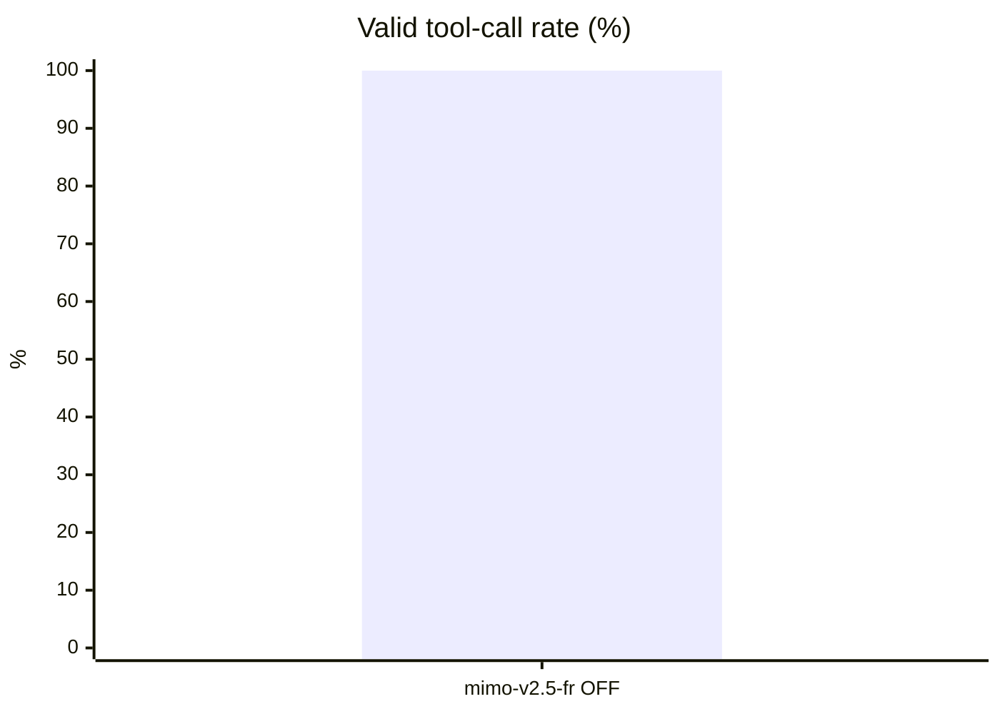
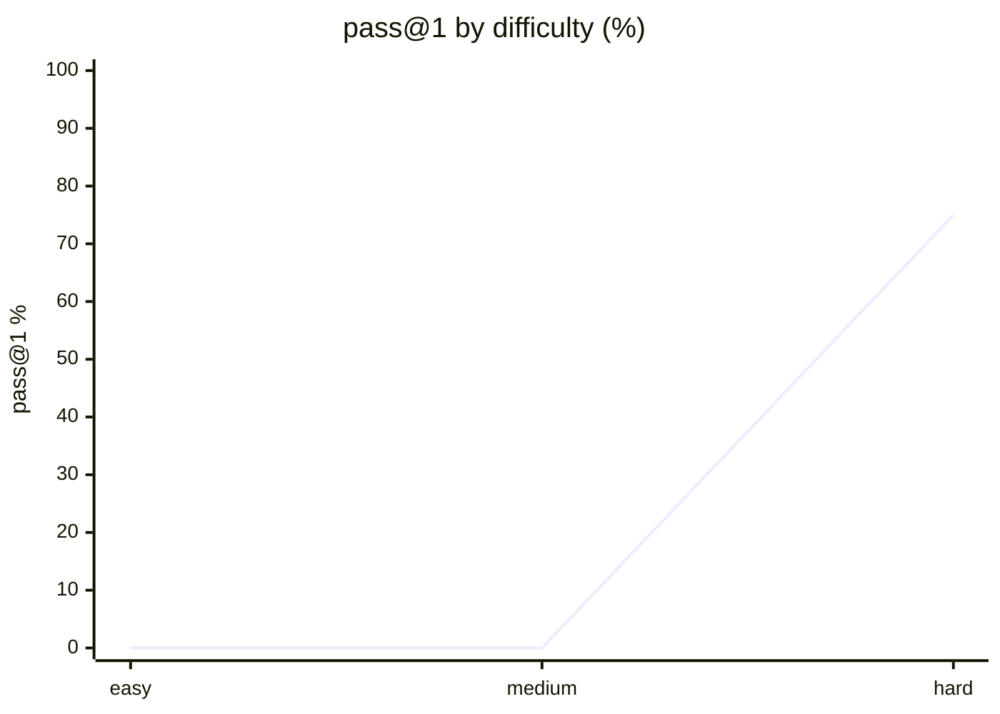

# Live setup: opencode

**Question.** Is opencode's current setup any good, and what should improve?

## Setup

| | |
|---|---|
| Endpoint | not recorded |
| Tasks | 8 |
| Samples per task | 1 (⇒ 8 generations per run) |
| Concurrency | 2 |
| Metric | pass@1 over hidden executable unit tests |

## Results

| Run | Agent score | Solved | Efficiency | Mean calls | Par | Valid calls | Turn-limit | Wall |
|---|---|---|---|---|---|---|---|---|
| **opencode live opencode-mimo-v2-5-free think-OFF** | **56.7** | 75.0 % | 75.6 % | 6.5 | 5.9 | 100.0 % | 0 | 474 s |

**Agent score** = solve rate x efficiency, out of 100 — solving is the price of entry, efficiency breaks the ties solve rate cannot. *Efficiency* = par tool calls / calls actually used, capped at 1 and counted only on solved tasks. *Par* is measured by running each task's oracle, so it does not depend on the model. *Valid calls* = calls that did not error. *Turn-limit* = runs abandoned without finishing.

Line 1 = opencode live opencode-mimo-v2-5-free think-OFF

## Suggestions — opencode live opencode-mimo-v2-5-free think-OFF

- This was a **live-mode** run of your daily setup: extensions, skills and MCP servers were enabled. Any component that can call another model contaminates these numbers — see the caveats section.

## Caveats

- 1 samples per task. Differences under ~8 points are noise, not signal.
- Multi-turn agentic tool use against a sandboxed workspace. One-shot code generation is not exercised here.
- Success is decided by a predicate over the final workspace, never by what the model claims. Every task's oracle is verified to solve it first.
- A task abandoned at the turn limit counts as failed; raise `--max-turns` before concluding the model cannot do it.

## Raw data

- `opencode-live-opencode-mimo-v2-5-free-think-off.json` — opencode live opencode-mimo-v2-5-free think-OFF
## Run context

_Collected at 2026-08-26 14:44 UTC — the conditions this result must be read against._

### Machine

| Field | Value |
|---|---|
| host | omachi |
| os | Omarchy 7.1.8-arch1-3 (x86_64) |
| cpu | Intel(R) Core(TM) i7-4578U CPU @ 3.00GHz — 4 threads |
| memory | 8 GiB, 4 GiB free at start |
| disk | 64G free on /home |
| load avg | 1.33 0.38 0.25 |

### GPU

No `nvidia-smi` — GPU unknown. On a hosted model this is expected and harmless;
on a local endpoint it means the serving device was not recorded.

### Serving endpoint

| Field | Value |
|---|---|
| base url | http://localhost:8001/v1 |
| serves | not reachable (hosted model, or nothing local is serving) |
| unit | inactive |

### Harness setup

A live run measures this surface, not the model alone. Every skill, MCP server and
extension below is part of the result.

| Field | Value |
|---|---|
| harness | opencode |
| model | opencode/mimo-v2.5-free |
| thinking | n/a |
| version | 1.18.21 |
| config | /home/omachi/.config/opencode/opencode.json |
| plugins | 1 in ~/.config/opencode/plugins |
| skills | 42 global |
| project context | CLAUDE.md AGENTS.md  |
## Surface usage

_52 tool calls, classified. Built-ins identified from the isolated arm._

| Kind | What | Calls |
|---|---|---|
| builtin | `read` | 24 |
| builtin | `edit` | 12 |
| builtin | `bash` | 11 |
| builtin | `glob` | 2 |
| builtin | `write` | 2 |
| builtin | `task` | 1 |

Installed vs called:

- **skills installed**: 42 global
- **plugins installed**: 1 in ~/.config/opencode/plugins

**The surface was idle.** Every call in this run was a built-in: no skill, MCP server or plugin was invoked. Whatever this run scored, the surface did not earn it — and anything it adds to the system prompt was paid for on every task for nothing.

## Surface A/B — live vs isolated

Same model, same suite, same samples. The live arm runs your daily surface; the isolated arm strips skills, MCP servers, plugins and settings.

| Metric | live | isolated | delta |
|---|---|---|---|
| agent score | 56.7 | 71.0 | -14.3 ✗ |
| solve rate % | 75.0 | 87.5 | -12.5 ✗ |
| efficiency % | 75.6 | 81.2 | -5.5 ✗ |
| calls / task | 6.5 | 6.8 | -0.2 ✓ |
| turns / task | 4.8 | 5.1 | -0.4 ✓ |
| input tok / task | 13740 | 13547 | +193 ✗ |
| output tok / task | 5267 | 1064 | +4202 ✗ |
| wall (s) | 474 | 193 | +281 ✗ |

The **isolated** arm is ahead by 14.3 points at 1 sample(s) — above the 8-point noise floor, so the gap is real. Read it together with the surface usage above: a gap with an idle surface is not caused by the surface.

Caveat: on claude-code the isolated arm also pins the built-in tool set (no Task/WebSearch/WebFetch), so its arm differs by more than the surface alone. `references/surface-ab.md` lists what each harness strips.
