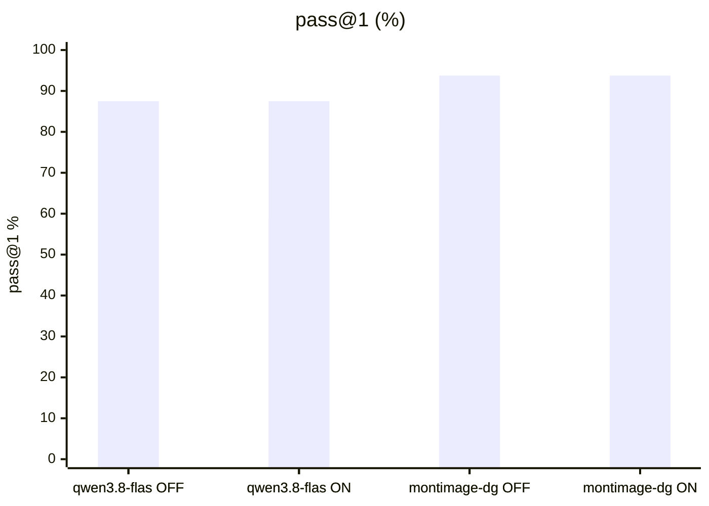
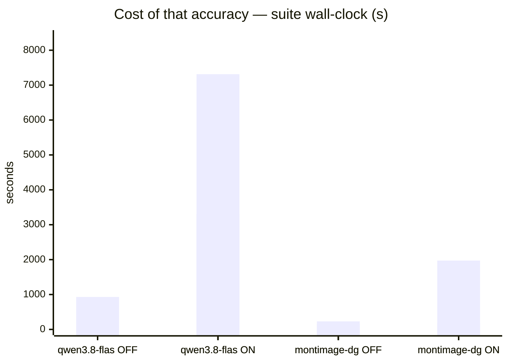
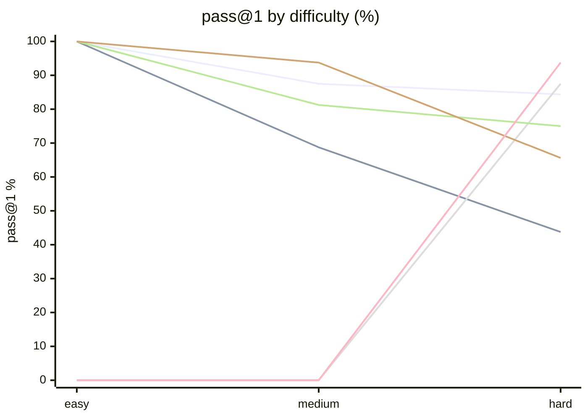

# Qwen3.8-Flash-Next vs Qwen3.6-35B-A3B

**Question.** Should Flash-Next replace the incumbent for local hosting?

**Verdict.** No. Keep the incumbent (unsloth/Qwen3.6-35B-A3B-NVFP4). Flash-Next wins only one-shot think-OFF (+10.7pp, borderline above noise at n=2) at 2x latency, and loses think-ON catastrophically (-28.6pp, reasoning burns the 16k budget), both agentic modes (-12.5pp each), while burning 2.6-6.5x tokens/task at roughly half the tok/s and needing a KV downgrade (22 to 18 GiB) to fit this box.

## Setup

| | |
|---|---|
| Endpoint | mixed — `http://localhost:8888` (qwen3.8-flas OFF), `http://localhost:8888` (qwen3.8-flas ON), `http://localhost:8888` (qwen3.8-flas OFF), `http://localhost:8888` (qwen3.8-flas ON), `http://localhost:8001` (montimage-dg OFF), `http://localhost:8001` (montimage-dg ON), `http://localhost:8001` (montimage-dg OFF), `http://localhost:8001` (montimage-dg ON) |
| Tasks | mixed — 28 (qwen3.8-flas OFF), 28 (qwen3.8-flas ON), 8 (qwen3.8-flas OFF), 8 (qwen3.8-flas ON), 28 (montimage-dg OFF), 28 (montimage-dg ON), 8 (montimage-dg OFF), 8 (montimage-dg ON) |
| Samples per task | 2 (⇒ mixed — 56 (qwen3.8-flas OFF), 56 (qwen3.8-flas ON), 16 (qwen3.8-flas OFF), 16 (qwen3.8-flas ON), 56 (montimage-dg OFF), 56 (montimage-dg ON), 16 (montimage-dg OFF), 16 (montimage-dg ON) generations per run) |
| Concurrency | 4 |
| Metric | pass@1 over hidden executable unit tests |

## Results

| Run | pass@1 | easy | medium | hard | Wall | Mean out tok | Truncated | tok/s |
|---|---|---|---|---|---|---|---|---|
| flash-next think-OFF | 87.5 % | 100.0 % | 87.5 % | 84.4 % | 514 s | 814 | 0 | 23.8 |
| flash-next think-ON | 58.9 % | 100.0 % | 68.8 % | 43.8 % | 7,314 s | 8,203 | 21 | 17.4 |
| flash-next agentic-OFF | 87.5 % | — | — | 87.5 % | 931 s | 3,171 | 0 | 12.1 |
| flash-next agentic-ON | 87.5 % | — | — | 87.5 % | 3,306 s | 12,322 | 0 | 16.7 |
| incumbent think-OFF | 80.4 % | 100.0 % | 81.2 % | 75.0 % | 231 s | 822 | 0 | 51.5 |
| incumbent think-ON | 78.6 % | 100.0 % | 93.8 % | 65.6 % | 1,973 s | 6,637 | 1 | 50.1 |
| **incumbent agentic-OFF** | 93.8 % | — | — | 93.8 % | 151 s | 1,197 | 0 | 34.5 |
| incumbent agentic-ON | 93.8 % | — | — | 93.8 % | 197 s | 1,897 | 0 | 41.2 |





```mermaid
xychart-beta
    title "Mean output tokens per answer"
    x-axis ["qwen3.8-flas OFF", "qwen3.8-flas ON", "qwen3.8-flas OFF", "qwen3.8-flas ON", "montimage-dg OFF", "montimage-dg ON", "montimage-dg OFF", "montimage-dg ON"]
    y-axis "tokens" 0 --> 1.417e+04
    bar [813.7, 8203, 3171, 1.232e+04, 821.7, 6637, 1197, 1897]
```



<sub>Line 1 = flash-next think-OFF · Line 2 = flash-next think-ON · Line 3 = flash-next agentic-OFF · Line 4 = flash-next agentic-ON · Line 5 = incumbent think-OFF · Line 6 = incumbent think-ON · Line 7 = incumbent agentic-OFF · Line 8 = incumbent agentic-ON</sub>

## Where they disagree — incumbent agentic-OFF vs incumbent agentic-ON

| Task | incumbent agentic-OFF | incumbent agentic-ON | Winner |
|---|---|---|---|
| `generalise_migration` | 50 % | 100 % | incumbent agentic-ON |
| `hidden_spec_compliance` | 100 % | 50 % | incumbent agentic-OFF |

## Reading the numbers

# Flash-Next vs incumbent — analyst notes (measured 2026-09-04, DGX Spark GB10)

## Serving notes (load-bearing for reproducibility)
- Candidate recipe `/tmp/opencode/flash-next` (clone of MiaAI-Lab/Qwen3.8-Flash-Next-Single-DGX-Spark),
  `.env` copied from `.env.sample` with shipped defaults EXCEPT one override:
  `KV_TARGET_GIB=18` (not 22) passed as env override — the shipped 22 GiB target derives
  container cap 105 GiB > hard ceiling 103 GiB on this 119 GiB box, and `start.sh` refuses.
  `.env` file itself untouched (still says 22). Served: 262k ctx, MTP 3, KV fp8, MAX_NUM_SEQS 4, port 8888.
- `start.sh` also needs `HF_HOME=/home/montimage/llm-serving/hf-cache` in this environment
  (default `$HOME/.cache/huggingface` has no such checkpoint; first launch attempt exited 1 on this).
- Incumbent was stopped via `systemctl --user stop vllm-qwen.service` (NOT plain `docker stop`:
  the unit has `Restart=always`, so docker-stop alone resurrects it in 15 s) and restored with
  `systemctl --user start vllm-qwen.service`. Router (`llm-router.service`, :8001) left running throughout.
- Candidate steady state: KV 18.88 GiB / 1,137,654 tokens, max concurrency 4.34x @262k. Health 200.

## Numbers (benchkit built-in loop, samples=2 — differences <~8pp are noise)
- One-shot `all`, think-OFF: flash-next pass@all 0.821 / pass@any 0.929 (wall 514 s, mean 814 tok,
  23.8 tok/s, 0/56 capped) vs incumbent 0.714 / 0.893 (wall 231 s, mean 822 tok, 51.5 tok/s, 0/56 capped).
  +10.7 pp for flash-next, just above noise — but at 2.2x wall time and ~2.2x slower decode.
- One-shot `all`, think-ON (16k cap): flash-next 0.464 / 0.714 (wall 7314 s, mean 8203 tok, med 8008,
  21/56 samples hit the 16k cap) vs incumbent 0.750 / 0.821 (wall 1973 s, mean 6637 tok, 1/56 capped).
  Flash-next collapses when thinking is on: reasoning burns the whole budget and it emits no usable
  answer (typical failure: 16000 tok then NameError on a never-defined function name).
  CONFOUND RISK: the incumbent is served with `--default-chat-template-kwargs
  {"enable_thinking":true,"preserve_thinking":true}` + qwen3 reasoning parser; the flash-next recipe
  sets a qwen3 reasoning parser but no template kwargs. Part of the think-ON gap may be
  template/harness handling rather than weights. Do not quote think-ON as a pure model gap.
- Agentic-hard, OFF: flash-next 0.75 solve / 1.0 any (wall 931 s, mean 3171 tok, 12.1 tok/s, 4/16 capped @6k)
  vs incumbent 0.875 / 1.0 (wall 151 s, mean 1197 tok, 34.5 tok/s, 0 capped). -12.5 pp.
- Agentic-hard, ON (10k cap): flash-next 0.75 / 1.0 (wall 3306 s, mean 12322 tok, med 4535, 7/16 capped)
  vs incumbent 0.875 / 1.0 (wall 197 s, mean 1897 tok, 41.2 tok/s, 0 capped). -12.5 pp at ~17x wall time.
- Throughput gap is structural, not noise: flash-next 12–24 tok/s vs incumbent 34–51 tok/s across all
  four runs (MTP 3 vs MTP 2, sparser/finer architecture, fp8 KV on QSA blocks).

## Verdict reasoning
Flash-next's only win is one-shot think-OFF (+10.7 pp, borderline above noise at n=2), bought with
2x latency. It loses think-ON catastrophically (-28.6 pp), loses both agentic modes (-12.5 pp each),
burns 2.6–6.5x the tokens per task, runs 2–3x slower per token, and needs a KV downgrade (22→18)
to fit this box's safety ceiling. For an always-on local host serving both one-shot and tool-loop
work through the router, that is not a replacement. Keep the incumbent; re-test flash-next only with
matched thinking/template settings and higher samples if the think-OFF edge matters.

## Caveats

- 2 samples per task. Differences under ~8 points are noise, not signal.
- Single-turn Python code generation only. Multi-turn agentic tool use is not exercised here.
- A truncated generation counts as a failure; a high `Truncated` column means runaway reasoning, which hangs real agents.

## Raw data

- `flash-next-think-off.json` — flash-next think-OFF
- `flash-next-think-on.json` — flash-next think-ON
- `flash-next-agentic-off.json` — flash-next agentic-OFF
- `flash-next-agentic-on.json` — flash-next agentic-ON
- `incumbent-think-off.json` — incumbent think-OFF
- `incumbent-think-on.json` — incumbent think-ON
- `incumbent-agentic-off.json` — incumbent agentic-OFF
- `incumbent-agentic-on.json` — incumbent agentic-ON
