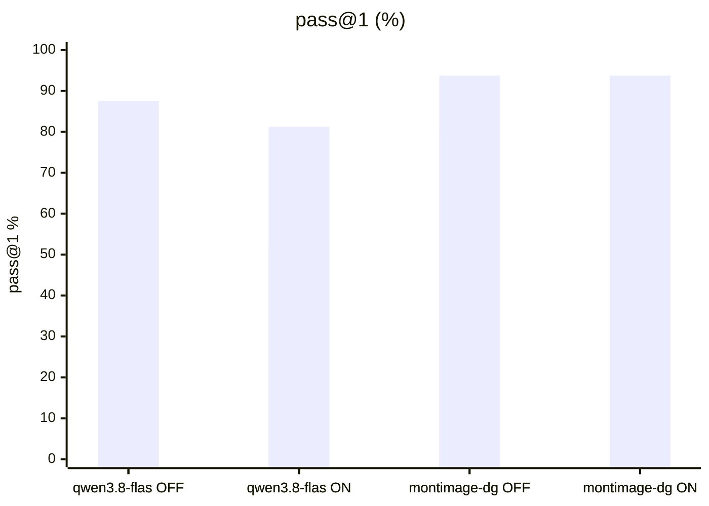
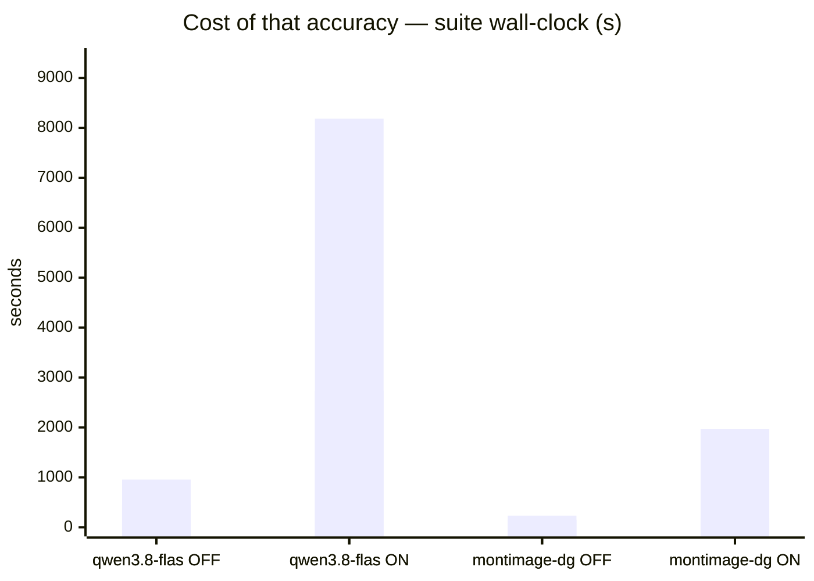
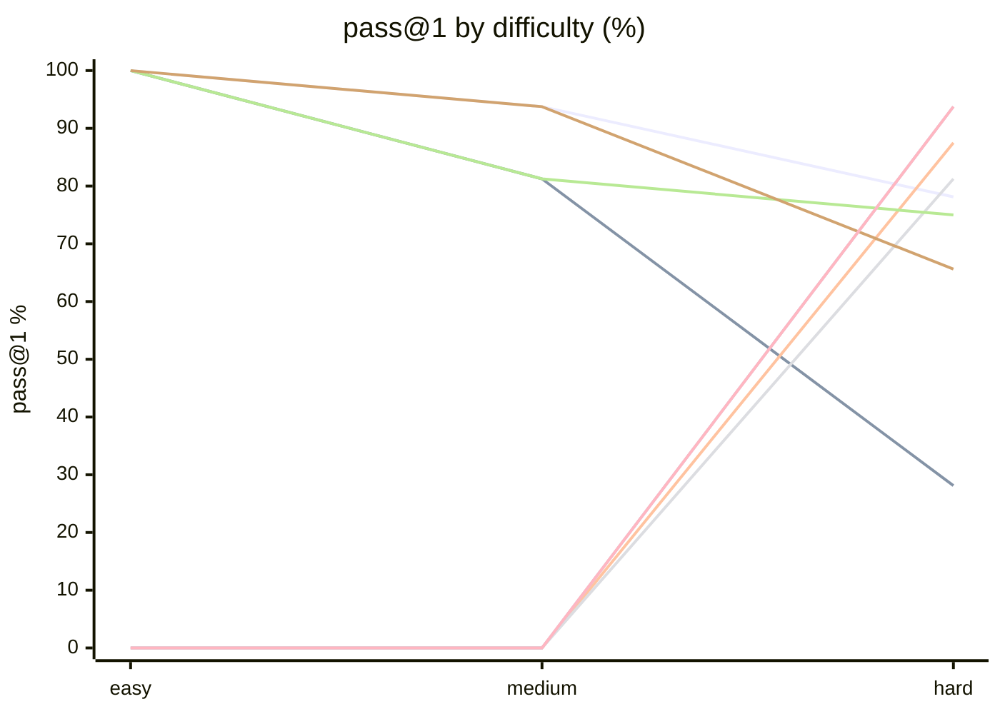

# Qwen3.8-Flash-Next (HEAD 203834c) vs Qwen3.6-35B-A3B

**Question.** Does the updated Flash-Next recipe change the verdict?

**Verdict.** No. Still not adopted: every v2-vs-v1 delta is inside noise, and vs the incumbent Flash-Next still loses think-ON catastrophically and both agentic modes at 2-4x wall time. The upstream HEAD fixes are a reliability win (host-side budget cap, no watchdog event), not an accuracy win.

## Setup

| | |
|---|---|
| Endpoint | mixed — `http://localhost:8888` (qwen3.8-flas OFF), `http://localhost:8888` (qwen3.8-flas ON), `http://localhost:8888` (qwen3.8-flas OFF), `http://localhost:8888` (qwen3.8-flas ON), `http://localhost:8001` (montimage-dg OFF), `http://localhost:8001` (montimage-dg ON), `http://localhost:8001` (montimage-dg OFF), `http://localhost:8001` (montimage-dg ON) |
| Tasks | mixed — 28 (qwen3.8-flas OFF), 28 (qwen3.8-flas ON), 8 (qwen3.8-flas OFF), 8 (qwen3.8-flas ON), 28 (montimage-dg OFF), 28 (montimage-dg ON), 8 (montimage-dg OFF), 8 (montimage-dg ON) |
| Samples per task | 2 (⇒ mixed — 56 (qwen3.8-flas OFF), 56 (qwen3.8-flas ON), 16 (qwen3.8-flas OFF), 16 (qwen3.8-flas ON), 56 (montimage-dg OFF), 56 (montimage-dg ON), 16 (montimage-dg OFF), 16 (montimage-dg ON) generations per run) |
| Concurrency | 4 |
| Metric | pass@1 over hidden executable unit tests |

## Results

| Run | pass@1 | easy | medium | hard | Wall | Mean out tok | Truncated | tok/s |
|---|---|---|---|---|---|---|---|---|
| flash-next-v2 think-OFF | 85.7 % | 100.0 % | 93.8 % | 78.1 % | 446 s | 726 | 0 | 23.7 |
| flash-next-v2 think-ON | 53.6 % | 100.0 % | 81.2 % | 28.1 % | 8,183 s | 9,138 | 25 | 16.9 |
| flash-next-v2 agentic-OFF | 87.5 % | — | — | 87.5 % | 955 s | 2,579 | 0 | 12.4 |
| flash-next-v2 agentic-ON | 81.2 % | — | — | 81.2 % | 2,730 s | 9,492 | 0 | 16.9 |
| incumbent think-OFF | 80.4 % | 100.0 % | 81.2 % | 75.0 % | 231 s | 822 | 0 | 51.5 |
| incumbent think-ON | 78.6 % | 100.0 % | 93.8 % | 65.6 % | 1,973 s | 6,637 | 1 | 50.1 |
| **incumbent agentic-OFF** | 93.8 % | — | — | 93.8 % | 151 s | 1,197 | 0 | 34.5 |
| incumbent agentic-ON | 93.8 % | — | — | 93.8 % | 197 s | 1,897 | 0 | 41.2 |





```mermaid
xychart-beta
    title "Mean output tokens per answer"
    x-axis ["qwen3.8-flas OFF", "qwen3.8-flas ON", "qwen3.8-flas OFF", "qwen3.8-flas ON", "montimage-dg OFF", "montimage-dg ON", "montimage-dg OFF", "montimage-dg ON"]
    y-axis "tokens" 0 --> 1.092e+04
    bar [726, 9138, 2579, 9492, 821.7, 6637, 1197, 1897]
```



<sub>Line 1 = flash-next-v2 think-OFF · Line 2 = flash-next-v2 think-ON · Line 3 = flash-next-v2 agentic-OFF · Line 4 = flash-next-v2 agentic-ON · Line 5 = incumbent think-OFF · Line 6 = incumbent think-ON · Line 7 = incumbent agentic-OFF · Line 8 = incumbent agentic-ON</sub>

## Where they disagree — incumbent agentic-OFF vs incumbent agentic-ON

| Task | incumbent agentic-OFF | incumbent agentic-ON | Winner |
|---|---|---|---|
| `generalise_migration` | 50 % | 100 % | incumbent agentic-ON |
| `hidden_spec_compliance` | 100 % | 50 % | incumbent agentic-OFF |

## Reading the numbers

# Flash-Next v2 (HEAD 203834c) analyst notes — measured 2026-09-05, DGX Spark GB10

## What changed upstream (5af8abd -> 203834c)

Host-side budget fix (the load-bearing one), MTP draft-vocab patch, FP8-KV
rework, cudagraph capture fix. `.env.sample` now ships `KV_TARGET_GIB=16` +
`HOST_RESERVE_GIB=26`; the old 22 GiB default that killed three servers on
2026-09-04 is gone. No env override was needed: `.env` is a byte copy of the
new `.env.sample`.

## Serving notes

- Recipe `/tmp/opencode/flash-next-v2` (fresh depth-1 clone, HEAD 203834c).
- Image `vllm/vllm-openai:qwen38-flash-next` (already cached digest
  `sha256:fc12...5be05`; pull was a no-op).
- Shipped profile served as-is: 262k ctx, MTP 3, KV fp8, MAX_NUM_SEQS 4,
  port 8888 (no comfy tenant, so no 8890 shift). PLE packed table reused from
  `/home/montimage/.cache/vllm/ple_cache` (27G, no rebuild).
- Budget actually applied: GPU budget 93.60 GiB (GMU 0.782); KV wish 16
  reduced to 14.67 by HOST_RESERVE_GIB=26; engine reports KV 15.67 GiB /
  944,227 tokens, 3.60x concurrency @262k. Time to `/health` 200 ~12 min
  (launch ~13:48 UTC, health 13:59:49 UTC).
- Incumbent stopped/restored ONLY via `systemctl --user stop/start
  vllm-qwen.service`; router left running. Restore verified: :8801 /health
  200, :8001 models list montimage-dgx-spark, chat completion "restore OK"
  (finish stop), open-webui healthy.

## Numbers (benchkit built-in loop, samples=2; <~8pp is noise)

- think-OFF: v2 85.7% (pass_all 0.750 / pass_any 0.964, wall 446 s, mean
  726 tok, 23.7 tok/s, 0 trunc) vs v1 87.5% (514 s, 814 tok) vs incumbent
  80.4% (231 s, 822 tok, 51.5 tok/s). Delta v2-v1 -1.8pp (noise); v2-inc
  +5.3pp (noise).
- think-ON (16k): v2 53.6% (0.464/0.607, wall 8183 s, 9138 tok, 16.9 tok/s,
  25/56 capped) vs v1 58.9% (7314 s, 8203 tok, 21 capped) vs incumbent 78.6%
  (1973 s, 6637 tok, 1 capped). Delta v2-v1 -5.3pp (noise); v2-inc -25.0pp.
  Same pathology as v1: reasoning burns the budget, emits no answer.
- agentic-OFF: v2 87.5% (agent score 30.3, wall 955 s, 2579 tok, 12.4 tok/s,
  8 turn-limits) vs v1 87.5% (931 s, 3171 tok). Identical score; delta 0.
  vs incumbent 93.8% (-6.3pp, noise).
- agentic-ON: v2 81.2% (score 28.7, wall 2730 s, 9492 tok, 3 turn-limit +
  6 stalled) vs v1 87.5% (3306 s, 12322 tok). Delta v2-v1 -6.3pp (noise);
  v2-inc -12.5pp. Only failing task flipped: v1 solved hidden_spec_compliance
  and failed perf_budget pattern differs — v2 fails hidden_spec_compliance
  (0/2) and splits perf_budget (1/2).

## Read

The upstream fixes are a reliability story, not a quality story. The host-side
budget cap is real (KV 16->~15 served, no watchdog event all session), but
accuracy moved nowhere: every v2-v1 delta is inside the ~8pp noise band at
n=2. Against the incumbent the verdict is unchanged: Flash-Next still wins
nothing outside noise on think-OFF, and still loses think-ON catastrophically
and both agentic modes, at 2-4x wall time and ~half the tok/s.

## Caveats

- 2 samples per task. Differences under ~8 points are noise, not signal.
- Single-turn Python code generation only. Multi-turn agentic tool use is not exercised here.
- A truncated generation counts as a failure; a high `Truncated` column means runaway reasoning, which hangs real agents.

## Raw data

- `flash-next-v2-think-off.json` — flash-next-v2 think-OFF
- `flash-next-v2-think-on.json` — flash-next-v2 think-ON
- `flash-next-v2-agentic-off.json` — flash-next-v2 agentic-OFF
- `flash-next-v2-agentic-on.json` — flash-next-v2 agentic-ON
- `incumbent-think-off.json` — incumbent think-OFF
- `incumbent-think-on.json` — incumbent think-ON
- `incumbent-agentic-off.json` — incumbent agentic-OFF
- `incumbent-agentic-on.json` — incumbent agentic-ON
